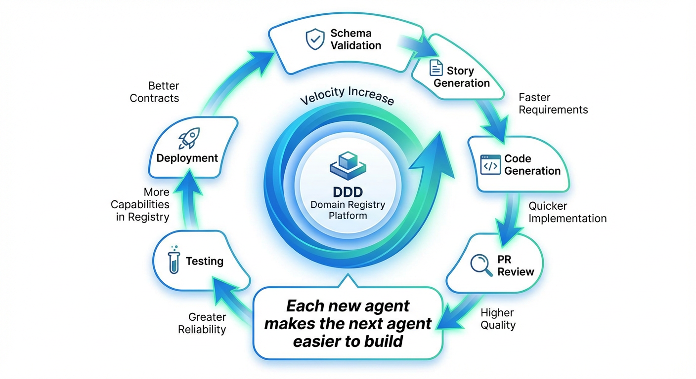
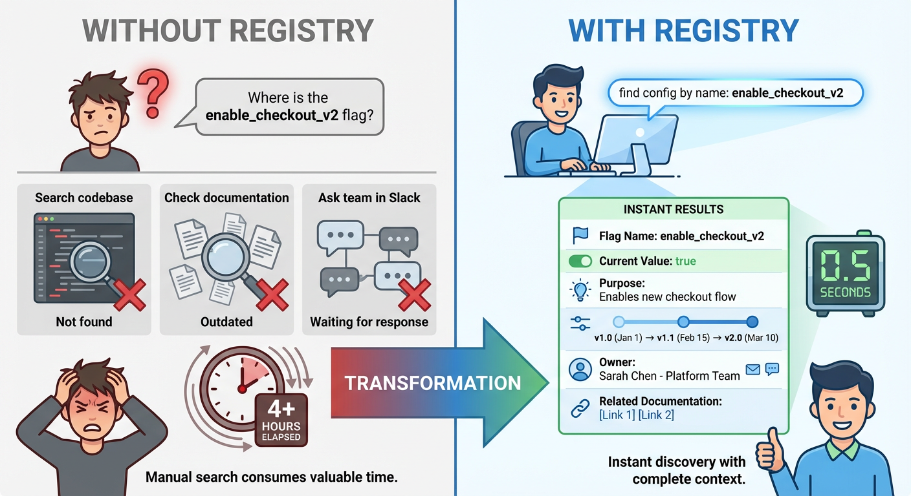

<!--
<metadata>
  <bounded_context>Platform.Overview</bounded_context>
  <intent>QuickStart</intent>
  <purpose>Provide value-focused introduction to DDD Domain Registry with quick start guide</purpose>
  <version>1.0.0</version>
  <last_updated>2026-01-23</last_updated>
  <status>Draft</status>
  <audience>Developers, Engineering Leadership, Product Teams</audience>
</metadata>
-->

# DDD Domain Registry & Unified Agent Interface

**Transform AI agent development through domain-driven design principles that enable discovery, composition, and orchestration at enterprise scale.**

---

## Why This Matters

Building AI agents is complex. Discovering existing capabilities is time-consuming. Composing agents into workflows is error-prone. Maintaining consistency across teams is nearly impossible. The DDD Domain Registry solves these challenges by treating agents as first-class domain concepts with discoverable capabilities, enforceable contracts, and composable value chains.


*Current state challenges vs. DDD Registry solution benefits*

**The Result:** Engineering teams build agents 6-8x faster while maintaining consistency, reliability, and compliance across your entire agent ecosystem.

---

## What You Get

### Domain Registry
A central source of truth for bounded contexts, domain models, and agent capabilities. Search for agents by intent, discover capabilities through domain concepts, and understand relationships through ubiquitous language.

### Unified Agent Interface
Standardized contracts for agent communication enabling seamless composition. Agents discover each other through domain intents, communicate via events or direct calls, and compose into value chains without tight coupling.

### Self-Bootstrapping SDLC Agents
Meta-agents that improve the system itself: Schema Validation Agent ensures contract compliance, Story Generator Agent creates requirements from domain models, Code Generator Agent scaffolds implementations, and Deployment Agent manages the entire lifecycle.


*Each new agent makes building the next agent easier - creating a compounding velocity effect*

### Event-Driven Orchestration
Choreograph complex workflows across agents with both orchestrated sagas and event-driven choreography. Built-in compensation handling, distributed tracing, and automatic rollback ensure reliability.

---

## Quick Start


*Step-by-step developer onboarding: From "I need an agent" to production deployment in minutes*

### 1. Install the Registry
```bash
npm install @glean/ddd-registry
```

### 2. Define Your First Bounded Context
```yaml
bounded_context:
  name: "ConfigurationManagement"
  ubiquitous_language:
    - term: "ConfigFlag"
      definition: "A feature flag or system setting"
  aggregates:
    - name: "ConfigFlag"
      intents: ["FindConfigByName", "ValidateConfigExists"]
```

### 3. Register an Agent
```typescript
await registry.registerAgent({
  agent_id: "config-agent-001",
  bounded_context: "ConfigurationManagement",
  supported_intents: [{
    intent_id: "cfg-001",
    intent_type: "Query",
    operation_name: "FindConfigByName"
  }]
});
```

### 4. Discover & Execute
```typescript
const agents = await registry.discoverAgents({
  operation_name: "FindConfigByName"
});

const result = await interface.executeIntent({
  intent_id: "cfg-001",
  input: { flag_name: "enable_feature_x" }
});
```

---

## Key Features

- **Domain-Aware Discovery:** Search for agents by domain concept, not just keywords
- **Contract Validation:** Automatic schema validation prevents runtime errors
- **Value Chain Composition:** Build complex workflows from reusable agent components
- **Event-Driven Architecture:** Loose coupling through domain events
- **Glean Platform Integration:** Seamless integration with Glean Search, Actions, and Agent Builder
- **Full Observability:** Distributed tracing, metrics, and audit logs out of the box
- **Permission Enforcement:** Bounded context access control integrated with Glean security

---

## Use Cases

### SDLC Automation
Schema validation, story generation, code scaffolding, PR review, deployment

### Journey Orchestration
Multi-system customer support workflows with breadcrumb tracking


*Example: Customer support journey orchestration across multiple systems with automatic breadcrumb tracking*

### Configuration Management
Flag discovery, expert finding, documentation generation


*Real-world use case: Developer workflow for finding feature flags, locating subject matter experts, and accessing documentation through unified agent interface*

### Knowledge Management
Article effectiveness tracking, KB search, automated updates

### Sales Enablement
Blueprint validation, deal strategy, competitive intelligence

---

## Architecture

The system consists of three layers:

1. **Domain Registry** - Bounded contexts and capabilities
2. **Unified Interface Layer** - Discovery, orchestration, events
3. **Glean Integration** - Search, actions, agent builder

Agents register their capabilities with domain intent contracts, discover each other through the registry, and compose into value chains using either orchestration or choreography patterns.

---

## Success Metrics

Organizations using the DDD Domain Registry report:

- **6-8x faster** agent development after SDLC bootstrapping
- **80% reduction** in schema validation errors
- **89% reduction** in story writing time
- **90% reduction** in capability discovery time
- **99% reliability** for value chain execution

---

## Documentation

- [Implementation Specification](./docs/product/implementation-specification.md) - Detailed technical architecture
- [Product Requirements Document](./docs/product/prd.md) - Complete feature specifications
- [Roadmap](./docs/product/roadmap.md) - Phased delivery plan with milestones
- [Headlines from the Future](./docs/marketing/headlines-from-future.md) - Realized benefits
- [Release Specifications](./docs/releases/) - Detailed specs per release

---

## Getting Started

1. **Read the PRD:** Understand the problem, solution, and success criteria
2. **Review the Implementation Spec:** Understand the technical architecture
3. **Explore the Roadmap:** See the phased delivery plan
4. **Join the Team:** Contact Engineering Platform Team for onboarding

---

## Project Status

**Current Phase:** MVP Implementation
**Target Start:** Q1 2026
**First Release:** Week 2 (Foundation + Schema Validation Agent)
**Peak Velocity:** Week 11 (Full SDLC Automation)

### 🎯 NEW: 2-Agent Staged Validation MVP (Completed)

A working implementation of the staged validation workflow pattern is now available! This MVP demonstrates Glean agent collaboration through XML prompt generation and quality validation.

**What's Implemented:**
- ✅ Document-driven workflow orchestration system
- ✅ 2 Glean agents (Prompt Generator + Prompt Validator)
- ✅ MCP server configuration with tool specifications
- ✅ Staged validation pattern with feedback loops
- ✅ Saga pattern state management
- ✅ Complete example library and documentation

**Quick Start:**
```bash
# View the workflow orchestration system
cd workflow-orchestration/

# Review agent specifications
ls agents/prompt-generator/
ls agents/prompt-validator/

# See the complete workflow definition
cat workflows/prompt-generation-workflow.json
```

**Use Case**: Generate high-quality XML-structured prompts through agent collaboration
- Input: Natural language request ("Create a prompt for meeting summarization")
- Process: Agent A generates → Agent B validates → Loop on failure (max 3 attempts)
- Output: Validated XML prompt with quality score ≥90

**Value Proposition**:
- Reduce prompt creation time: 15min → <3min (80% reduction)
- Ensure quality: Automated validation with multi-dimensional scoring
- Enable non-technical users: No XML expertise required
- Demonstrate agent patterns: Foundation for SDLC automation

**Documentation**:
- [Workflow Orchestration System](workflow-orchestration/README.md)
- [Prompt Generation Workflow](workflow-orchestration/workflows/prompt-generation/README.md)
- [Agent A (Generator)](agents/prompt-generator/README.md)
- [Agent B (Validator)](agents/prompt-validator/README.md)
- [MCP Server Setup](mcp-servers/prompt-engineering/README.md)
- [Staged Validation Pattern](docs/concepts/a-b-workflow.md)

**Next Steps**:
1. Deploy to Glean instance (register MCP server + agents)
2. Run integration tests
3. Collect metrics and iterate
4. Scale to additional workflows (Schema Validation → Story Generation)

---

## Contributing

This platform follows Domain-Driven Design principles. All contributions should:

- Align with a bounded context
- Include explicit intent contracts
- Provide comprehensive tests
- Update the domain registry
- Include documentation

See [CONTRIBUTING.md](./CONTRIBUTING.md) for detailed guidelines.


---

*"Transform complexity into composability through domain-driven agent design."*
