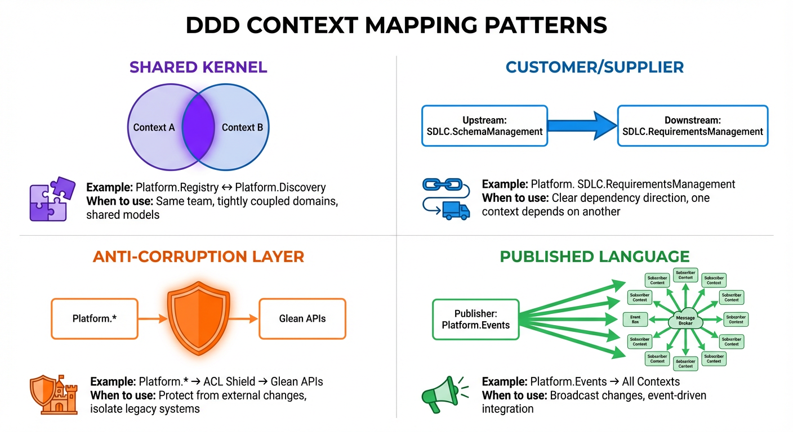
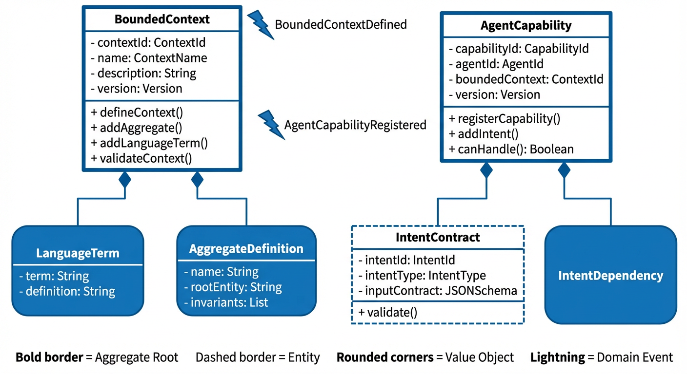
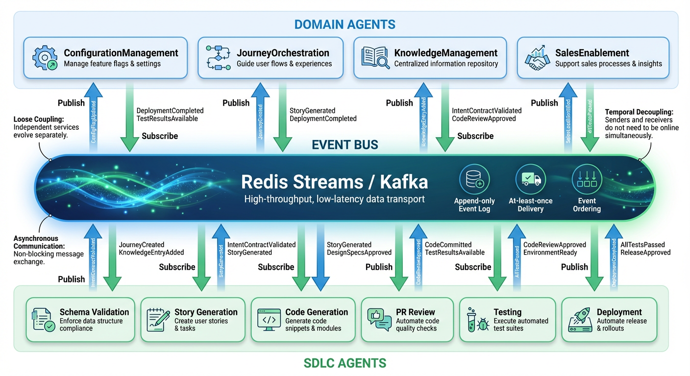

<!--
<metadata>
  <bounded_context>Architecture.DomainModel</bounded_context>
  <intent>ArchitectureSpecification</intent>
  <purpose>Comprehensive Domain-Driven Design architecture specification with ASCII diagrams for DDD Domain Registry platform</purpose>
  <version>1.0.0</version>
  <last_updated>2026-01-23</last_updated>
  <status>Draft</status>
  <owner>Platform Architecture Team</owner>
  <architecture_style>Domain-Driven Design, Event-Driven Architecture, Microservices</architecture_style>
</metadata>
-->

# DDD Architecture Specification
## Domain Registry & Unified Agent Interface Platform

**Version:** 1.0.0
**Date:** 2026-01-23
**Architect:** Platform Architecture Team

---

## Executive Summary

### Domain Overview
The DDD Domain Registry & Unified Agent Interface Platform is a **meta-platform** that manages AI agents as first-class domain concepts. The system enables discovery, composition, and orchestration of Glean agents through domain-driven principles rather than technical implementation details.

### Bounded Contexts Identified
**Total:** 15 bounded contexts across 3 major subdomains

**Platform Core (Core Domain):**
- Platform.Registry
- Platform.Discovery
- Platform.Orchestration
- Platform.Events

**SDLC Automation (Supporting Subdomain):**
- SDLC.SchemaManagement
- SDLC.RequirementsManagement
- SDLC.CodeGeneration
- SDLC.CodeReview
- SDLC.Testing
- SDLC.Deployment
- SDLC.Documentation

**Domain Agents (Supporting Subdomains):**
- ConfigurationManagement
- JourneyOrchestration
- KnowledgeManagement
- SalesEnablement

### Key Architectural Decisions

**See [CORE-PRINCIPLES.md](./CORE-PRINCIPLES.md) for non-negotiable constraints.**

1. **Strategic Pattern Choice:** Context mapping with explicit relationship types to manage complexity
2. **Event-Driven Architecture:** Domain events as primary integration mechanism between contexts
3. **Saga Pattern:** For multi-step value chain orchestration with compensation
4. **Meta-Agent Strategy:** SDLC agents that improve the platform itself (self-bootstrapping)
5. **Glean Integration:** Anti-Corruption Layer to isolate from Glean platform changes
6. **Agent Implementation Pattern:** Unified Glean MCP agent integration
   - **REQUIRED:** All LLM compute via `mcp__glean__chat` or Claude Code (see [CORE-PRINCIPLES.md](./CORE-PRINCIPLES.md))
   - **Glean MCP Agents:** All agent capabilities accessed via `mcp__glean__chat` tool
   - **XML Prompt Templates:** Optional structured templates that format messages sent to Glean agents, stored in [`sdlc/prompts`](../../sdlc/prompts) repository
   - **Prohibited:** Direct Anthropic API usage, ANTHROPIC_API_KEY environment variables, model specifications

### Domain Complexity Classification
- **Core Domain:** Platform.Registry, Platform.Orchestration (high complexity, high business value)
- **Supporting Subdomains:** SDLC.*, domain agents (medium complexity, medium business value)
- **Generic Subdomain:** Platform.Events (low complexity, off-the-shelf event store)

---

## Ubiquitous Language Glossary

### Platform.Registry Context

| Term | Definition |
|------|------------|
| **Bounded Context** | A specific responsibility boundary with its own domain model and ubiquitous language |
| **Agent Capability** | The set of domain intents an agent can handle |
| **Intent Contract** | A formal specification of an operation's input, output, and constraints |
| **Aggregate Root** | The entry point entity for accessing an aggregate |
| **Ubiquitous Language** | Shared vocabulary between domain experts and developers within a context |
| **Domain Event** | An immutable record of something that happened in the domain |
| **Glean MCP Agent** | An existing Glean agent invoked via Model Context Protocol using `mcp__glean__chat` tool |
| **XML Prompt Template** | A structured XML template that formats messages sent to Glean agents via `mcp__glean__chat`, stored in `sdlc/prompts` repository |
| **Message Template** | An XML template defining role, task, instructions, and constraints used to structure inputs to Glean agents |

### Platform.Orchestration Context

| Term | Definition |
|------|------------|
| **Value Chain** | A sequence of agent operations that creates business value |
| **Saga** | A long-running transaction with compensation logic for rollback |
| **Orchestration** | Central coordinator manages workflow steps |
| **Choreography** | Event-driven coordination between agents |
| **Compensation** | Rollback logic executed when a step fails |
| **Step Dependency** | Requirement that one step completes before another starts |

### Platform.Discovery Context

| Term | Definition |
|------|------------|
| **Intent Matching** | Algorithm to find agents capable of handling an intent |
| **Confidence Score** | Measure of how well an agent matches an intent (0-1) |
| **Capability Index** | Searchable index of agent capabilities |

### SDLC.SchemaManagement Context

| Term | Definition |
|------|------------|
| **Schema Validation** | Verifying intent contracts against JSON Schema |
| **Contract Compliance** | Agent implementation matches declared contracts |
| **Breaking Change** | Modification that requires consumer updates |

### ConfigurationManagement Context

| Term | Definition |
|------|------------|
| **Config Flag** | A feature flag or system setting |
| **Config Value** | The actual value of a configuration |
| **Flag Registry** | Central repository of all configuration flags |

### JourneyOrchestration Context

| Term | Definition |
|------|------------|
| **Journey** | End-to-end customer support case across systems |
| **Breadcrumb** | Trail of journey through multiple systems |
| **Journey State** | Current status of journey (Created, Routing, Resolved, Orphaned) |
| **Routing Decision** | Determination of which system should handle case |

---

## Context Map


*Bounded Context Landscape Map showing all 15 contexts organized by subdomain (Platform Core, SDLC Automation, Domain Agents) with relationship patterns*

### Strategic Context Map

```
┌─────────────────────────────────────────────────────────────────────────────┐
│                          PLATFORM CORE DOMAIN                                │
│                                                                               │
│  ┌──────────────────┐         ┌──────────────────┐                          │
│  │ Platform.Registry│═════════│Platform.Discovery│                          │
│  │  (Core Domain)   │  Shared │ (Core Domain)    │                          │
│  │                  │  Kernel │                  │                          │
│  └────────┬─────────┘         └─────────┬────────┘                          │
│           │                             │                                    │
│           │ Customer/                   │ Customer/                          │
│           │ Supplier                    │ Supplier                          │
│           │                             │                                    │
│           ↓                             ↓                                    │
│  ┌──────────────────┐         ┌──────────────────┐                          │
│  │Platform.         │         │ Platform.Events  │                          │
│  │Orchestration     │◄────────│  (Generic)       │                          │
│  │(Core Domain)     │Subscribe│                  │                          │
│  └──────────────────┘         └──────────────────┘                          │
│           │                             ▲                                    │
└───────────┼─────────────────────────────┼────────────────────────────────────┘
            │ ACL                         │ Publish
            │                             │
┌───────────▼─────────────────────────────┼────────────────────────────────────┐
│                     SDLC AUTOMATION SUBDOMAIN                                 │
│                                                                               │
│  ┌──────────────────┐         ┌──────────────────┐                          │
│  │ SDLC.Schema      │────────>│ SDLC.Requirements│                          │
│  │ Management       │ Events  │ Management       │                          │
│  └──────────────────┘         └────────┬─────────┘                          │
│                                        │ Events                              │
│                                        ↓                                     │
│  ┌──────────────────┐         ┌──────────────────┐                          │
│  │ SDLC.Code        │────────>│ SDLC.CodeReview  │                          │
│  │ Generation       │ Events  │                  │                          │
│  └──────────────────┘         └────────┬─────────┘                          │
│                                        │ Events                              │
│                                        ↓                                     │
│  ┌──────────────────┐         ┌──────────────────┐                          │
│  │ SDLC.Testing     │────────>│ SDLC.Deployment  │                          │
│  │                  │ Events  │                  │                          │
│  └──────────────────┘         └──────────────────┘                          │
│                                        ▲                                     │
│                                        │ Uses                                │
│  ┌──────────────────┐                 │                                     │
│  │ SDLC.            │─────────────────┘                                     │
│  │ Documentation    │                                                        │
│  └──────────────────┘                                                        │
│           │                                                                  │
└───────────┼──────────────────────────────────────────────────────────────────┘
            │ ACL
            │
┌───────────▼──────────────────────────────────────────────────────────────────┐
│                     DOMAIN AGENT SUBDOMAIN                                    │
│                                                                               │
│  ┌──────────────────┐         ┌──────────────────┐                          │
│  │ Configuration    │         │ Journey          │                          │
│  │ Management       │         │ Orchestration    │                          │
│  └──────────────────┘         └────────┬─────────┘                          │
│                                        │ Customer/                           │
│                                        │ Supplier                            │
│  ┌──────────────────┐                 ↓                                     │
│  │ Knowledge        │         ┌──────────────────┐                          │
│  │ Management       │◄────────│ Sales Enablement │                          │
│  └──────────────────┘ Events  │                  │                          │
│                                └──────────────────┘                          │
└───────────────────────────────────────────────────────────────────────────────┘

┌───────────────────────────────────────────────────────────────────────────────┐
│                         EXTERNAL SYSTEMS                                       │
│                                                                                │
│  ┌──────────────┐  ┌──────────────┐  ┌──────────────┐  ┌──────────────┐    │
│  │ Glean Search │  │ Glean Agent  │  │ Glean Actions│  │ Glean MCP    │    │
│  │     API      │  │   Builder    │  │     API      │  │   Server     │    │
│  └──────────────┘  └──────────────┘  └──────────────┘  └──────────────┘    │
│         ▲                ▲                  ▲                  ▲              │
└─────────┼────────────────┼──────────────────┼──────────────────┼──────────────┘
          │                │                  │                  │
          └────────────────┴──────────────────┴──────────────────┘
                                     │
                          [Anti-Corruption Layer]
                                     │
                          Platform.GleanIntegration

Legend:
═════  Shared Kernel (shared domain model)
────>  Customer/Supplier (downstream depends on upstream)
····>  Conformist (downstream conforms to upstream model)
 ACL   Anti-Corruption Layer (translation layer)
```

### Context Relationship Details


*DDD context relationship patterns: Shared Kernel, Customer/Supplier, Anti-Corruption Layer, Published Language, and Conformist - with usage guidelines and trade-offs*

| From Context | To Context | Relationship Type | Description |
|--------------|------------|-------------------|-------------|
| Platform.Registry | Platform.Discovery | Shared Kernel | Share AgentCapability and IntentContract models |
| Platform.Registry | Platform.Orchestration | Customer/Supplier | Registry supplies agent metadata to orchestrator |
| Platform.Discovery | Platform.Orchestration | Customer/Supplier | Discovery supplies matched agents to orchestrator |
| Platform.Events | All Contexts | Published Language | Event schema shared across all contexts |
| SDLC.SchemaManagement | SDLC.RequirementsManagement | Customer/Supplier | Validated intents flow to story generation |
| SDLC.RequirementsManagement | SDLC.CodeGeneration | Customer/Supplier | Stories flow to code generation |
| SDLC.CodeGeneration | SDLC.CodeReview | Customer/Supplier | Generated code flows to review |
| SDLC.CodeReview | SDLC.Testing | Customer/Supplier | Reviewed code flows to testing |
| SDLC.Testing | SDLC.Deployment | Customer/Supplier | Tested artifacts flow to deployment |
| JourneyOrchestration | KnowledgeManagement | Customer/Supplier | Journey resolution triggers KB effectiveness calculation |
| Platform.* | Glean APIs | Anti-Corruption Layer | Isolate platform from Glean API changes |

---

## Bounded Context Details

### Platform.Registry (Core Domain)

**Type:** Core Domain
**Responsibilities:**
- Manage bounded context definitions
- Register and store agent capabilities
- Validate intent contracts
- Provide search interface for capabilities
- Version control for domain models


*DDD aggregate design patterns showing root entities, value objects, invariants, and domain events for the platform*

#### Aggregate Map

```
┌──────────────────────────────────────────────────────────────┐
│                   Platform.Registry Aggregates                │
├──────────────────────────────────────────────────────────────┤
│                                                               │
│  ┌─────────────────────────────────────────────────────┐    │
│  │  BoundedContext (Aggregate Root)                     │    │
│  │  ════════════════════════════════                    │    │
│  │  - contextId: ContextId                              │    │
│  │  - name: ContextName                                 │    │
│  │  - description: String                               │    │
│  │  - ubiquitousLanguage: List<LanguageTerm>           │    │
│  │  - aggregates: List<AggregateDefinition>            │    │
│  │  - version: Version                                  │    │
│  │                                                       │    │
│  │  + defineContext()                                   │    │
│  │  + addAggregate(aggregate)                          │    │
│  │  + addLanguageTerm(term, definition)                │    │
│  │  + validateContext()                                 │    │
│  │                                                       │    │
│  │  Contains:                                           │    │
│  │  ┌──────────────────────────────────────┐          │    │
│  │  │ LanguageTerm (Value Object)          │          │    │
│  │  │ - term: String                       │          │    │
│  │  │ - definition: String                 │          │    │
│  │  └──────────────────────────────────────┘          │    │
│  │                                                       │    │
│  │  ┌──────────────────────────────────────┐          │    │
│  │  │ AggregateDefinition (Value Object)   │          │    │
│  │  │ - name: String                       │          │    │
│  │  │ - rootEntity: String                 │          │    │
│  │  │ - invariants: List<String>          │          │    │
│  │  └──────────────────────────────────────┘          │    │
│  └─────────────────────────────────────────────────────┘    │
│                                                               │
│  ┌─────────────────────────────────────────────────────┐    │
│  │  AgentCapability (Aggregate Root)                    │    │
│  │  ══════════════════════════════                      │    │
│  │  - capabilityId: CapabilityId                        │    │
│  │  - agentId: AgentId                                  │    │
│  │  - agentName: String                                 │    │
│  │  - boundedContext: ContextId                         │    │
│  │  - supportedIntents: List<IntentContract>           │    │
│  │  - dependencies: List<IntentDependency>             │    │
│  │  - version: Version                                  │    │
│  │  - registeredAt: Timestamp                           │    │
│  │                                                       │    │
│  │  + registerCapability()                              │    │
│  │  + addIntent(intent)                                │    │
│  │  + declareDependency(intent, context)               │    │
│  │  + validateCapability()                              │    │
│  │  + canHandle(intentId): Boolean                     │    │
│  │                                                       │    │
│  │  Contains:                                           │    │
│  │  ┌──────────────────────────────────────┐          │    │
│  │  │ IntentContract (Entity)              │          │    │
│  │  │ - intentId: IntentId                 │          │    │
│  │  │ - intentType: IntentType             │          │    │
│  │  │ - operationName: String              │          │    │
│  │  │ - inputContract: JSONSchema          │          │    │
│  │  │ - outputContract: JSONSchema         │          │    │
│  │  │ - preconditions: List<String>       │          │    │
│  │  │ - postconditions: List<String>      │          │    │
│  │  │                                      │          │    │
│  │  │ + validate(): ValidationResult      │          │    │
│  │  │ + isCompatibleWith(other): Boolean  │          │    │
│  │  └──────────────────────────────────────┘          │    │
│  │                                                       │    │
│  │  ┌──────────────────────────────────────┐          │    │
│  │  │ IntentDependency (Value Object)      │          │    │
│  │  │ - requiredIntent: IntentId           │          │    │
│  │  │ - targetContext: ContextId           │          │    │
│  │  │ - invocationPattern: Pattern         │          │    │
│  │  └──────────────────────────────────────┘          │    │
│  └─────────────────────────────────────────────────────┘    │
│                                                               │
└──────────────────────────────────────────────────────────────┘
```

#### Value Objects

```
IntentId (Value Object)
┌──────────────────────────┐
│ - value: String          │
│ - pattern: ^[a-z]+-[0-9]{3}$│
│                          │
│ + isValid(): Boolean     │
│ + equals(other): Boolean │
└──────────────────────────┘

IntentType (Enumeration)
┌──────────────────────────┐
│ - QUERY                  │
│ - COMMAND                │
│ - EVENT                  │
└──────────────────────────┘

Version (Value Object)
┌──────────────────────────┐
│ - major: Integer         │
│ - minor: Integer         │
│ - patch: Integer         │
│                          │
│ + incrementMajor()       │
│ + incrementMinor()       │
│ + isCompatibleWith(other)│
└──────────────────────────┘
```

#### Domain Events

```
BoundedContextDefined
├─ contextId: ContextId
├─ name: String
├─ definedAt: Timestamp
└─ definedBy: UserId

AgentCapabilityRegistered
├─ capabilityId: CapabilityId
├─ agentId: AgentId
├─ boundedContext: ContextId
├─ supportedIntents: List<IntentId>
├─ registeredAt: Timestamp
└─ registeredBy: UserId

IntentContractValidated
├─ intentId: IntentId
├─ isValid: Boolean
├─ validationErrors: List<ValidationError>
├─ validatedAt: Timestamp
└─ schemaVersion: Version

CapabilityUpdated
├─ capabilityId: CapabilityId
├─ previousVersion: Version
├─ newVersion: Version
├─ changes: List<Change>
└─ updatedAt: Timestamp
```

#### Invariants

1. **BoundedContext.contextId must be unique across all contexts**
2. **IntentContract.intentId must be unique within a BoundedContext**
3. **AgentCapability can only reference intents within its BoundedContext**
4. **Version changes must follow semantic versioning rules**
5. **IntentContract input/output schemas must be valid JSON Schema Draft 7+**

#### Repositories

```typescript
interface BoundedContextRepository {
  save(context: BoundedContext): Promise<void>
  findById(id: ContextId): Promise<BoundedContext | null>
  findByName(name: string): Promise<BoundedContext | null>
  findAll(): Promise<List<BoundedContext>>
  delete(id: ContextId): Promise<void>
}

interface AgentCapabilityRepository {
  save(capability: AgentCapability): Promise<void>
  findById(id: CapabilityId): Promise<AgentCapability | null>
  findByAgentId(agentId: AgentId): Promise<AgentCapability | null>
  findByContext(contextId: ContextId): Promise<List<AgentCapability>>
  findByIntent(intentId: IntentId): Promise<List<AgentCapability>>
  delete(id: CapabilityId): Promise<void>
}
```

---

### Platform.Discovery (Core Domain)

**Type:** Core Domain
**Responsibilities:**
- Match intents to capable agents
- Rank agents by confidence scores
- Maintain capability search index
- Validate contract compatibility
- Filter results by permissions

#### Aggregate Map

```
┌──────────────────────────────────────────────────────────────┐
│                Platform.Discovery Aggregates                  │
├──────────────────────────────────────────────────────────────┤
│                                                               │
│  ┌─────────────────────────────────────────────────────┐    │
│  │  IntentMatch (Aggregate Root)                        │    │
│  │  ═══════════════════════                             │    │
│  │  - matchId: MatchId                                  │    │
│  │  - requestedIntent: IntentId                         │    │
│  │  - matchedAgents: List<AgentMatch>                  │    │
│  │  - context: ExecutionContext                         │    │
│  │  - matchedAt: Timestamp                              │    │
│  │                                                       │    │
│  │  + findMatches(intent, context)                     │    │
│  │  + rankByConfidence()                                │    │
│  │  + filterByPermissions()                             │    │
│  │  + selectBestMatch(): AgentMatch                    │    │
│  │                                                       │    │
│  │  Contains:                                           │    │
│  │  ┌──────────────────────────────────────┐          │    │
│  │  │ AgentMatch (Entity)                  │          │    │
│  │  │ - agentId: AgentId                   │          │    │
│  │  │ - confidence: Confidence             │          │    │
│  │  │ - capability: AgentCapability        │          │    │
│  │  │ - compatibilityScore: Decimal        │          │    │
│  │  │                                      │          │    │
│  │  │ + calculateConfidence()              │          │    │
│  │  │ + validatePermissions(user)          │          │    │
│  │  └──────────────────────────────────────┘          │    │
│  │                                                       │    │
│  │  ┌──────────────────────────────────────┐          │    │
│  │  │ ExecutionContext (Value Object)      │          │    │
│  │  │ - userId: UserId                     │          │    │
│  │  │ - permissions: Set<Permission>       │          │    │
│  │  │ - correlationId: UUID                │          │    │
│  │  └──────────────────────────────────────┘          │    │
│  └─────────────────────────────────────────────────────┘    │
│                                                               │
└──────────────────────────────────────────────────────────────┘
```

#### Value Objects

```
Confidence (Value Object)
┌──────────────────────────┐
│ - value: Decimal         │
│ - range: [0.0, 1.0]      │
│                          │
│ + isHigh(): Boolean      │ // > 0.8
│ + isMedium(): Boolean    │ // 0.5-0.8
│ + isLow(): Boolean       │ // < 0.5
└──────────────────────────┘

MatchCriteria (Value Object)
┌──────────────────────────┐
│ - intentType: IntentType │
│ - contextId: ContextId   │
│ - operationName: String  │
│ - keywords: List<String> │
└──────────────────────────┘
```

#### Domain Events

```
IntentMatchRequested
├─ matchId: MatchId
├─ requestedIntent: IntentId
├─ userId: UserId
├─ requestedAt: Timestamp
└─ criteria: MatchCriteria

AgentMatchFound
├─ matchId: MatchId
├─ agentId: AgentId
├─ confidence: Confidence
├─ foundAt: Timestamp
└─ rank: Integer

NoMatchFound
├─ matchId: MatchId
├─ requestedIntent: IntentId
├─ searchedAt: Timestamp
└─ reason: String
```

#### Domain Services

```typescript
interface IntentMatchingService {
  /**
   * Find all agents capable of handling an intent
   * Uses fuzzy matching on operation names and keywords
   */
  matchIntent(
    intent: DomainIntent,
    context: ExecutionContext
  ): Promise<List<AgentMatch>>

  /**
   * Calculate confidence score based on:
   * - Exact intent match (1.0)
   * - Operation name similarity (0.6-0.9)
   * - Keyword overlap (0.4-0.7)
   * - Context relevance (0.3-0.5)
   */
  calculateConfidence(
    intent: DomainIntent,
    capability: AgentCapability
  ): Confidence
}
```

---

### Platform.Orchestration (Core Domain)

**Type:** Core Domain
**Responsibilities:**
- Execute value chains with saga pattern
- Manage step dependencies
- Handle compensation for failures
- Coordinate cross-context operations
- Maintain execution state

#### Aggregate Map

```
┌──────────────────────────────────────────────────────────────┐
│              Platform.Orchestration Aggregates                │
├──────────────────────────────────────────────────────────────┤
│                                                               │
│  ┌─────────────────────────────────────────────────────┐    │
│  │  ValueChain (Aggregate Root)                         │    │
│  │  ═════════════════════                               │    │
│  │  - chainId: ChainId                                  │    │
│  │  - name: String                                      │    │
│  │  - steps: List<ChainStep>                           │    │
│  │  - pattern: OrchestrationPattern                    │    │
│  │  - status: ChainStatus                               │    │
│  │  - createdAt: Timestamp                              │    │
│  │                                                       │    │
│  │  + defineChain(steps)                                │    │
│  │  + validateChain()                                   │    │
│  │  + execute(context): ExecutionResult                │    │
│  │  + compensate(fromStep)                              │    │
│  │                                                       │    │
│  │  Contains:                                           │    │
│  │  ┌──────────────────────────────────────┐          │    │
│  │  │ ChainStep (Entity)                   │          │    │
│  │  │ - stepId: StepId                     │          │    │
│  │  │ - agentId: AgentId                   │          │    │
│  │  │ - intent: IntentId                   │          │    │
│  │  │ - dependencies: Set<StepId>          │          │    │
│  │  │ - compensation: CompensationLogic    │          │    │
│  │  │ - status: StepStatus                 │          │    │
│  │  │                                      │          │    │
│  │  │ + canExecute(): Boolean              │          │    │
│  │  │ + execute(input)                     │          │    │
│  │  │ + compensate()                       │          │    │
│  │  └──────────────────────────────────────┘          │    │
│  └─────────────────────────────────────────────────────┘    │
│                                                               │
│  ┌─────────────────────────────────────────────────────┐    │
│  │  SagaExecution (Aggregate Root)                      │    │
│  │  ═══════════════════════                             │    │
│  │  - executionId: ExecutionId                          │    │
│  │  - chainId: ChainId                                  │    │
│  │  - correlationId: UUID                               │    │
│  │  - executedSteps: List<ExecutedStep>                │    │
│  │  - currentStep: StepId                               │    │
│  │  - status: SagaStatus                                │    │
│  │  - startedAt: Timestamp                              │    │
│  │  - completedAt: Timestamp?                           │    │
│  │                                                       │    │
│  │  + startExecution()                                  │    │
│  │  + executeStep(stepId)                               │    │
│  │  + recordSuccess(stepId, result)                    │    │
│  │  + recordFailure(stepId, error)                     │    │
│  │  + initiateCompensation()                            │    │
│  │  + completeExecution()                               │    │
│  │                                                       │    │
│  │  Contains:                                           │    │
│  │  ┌──────────────────────────────────────┐          │    │
│  │  │ ExecutedStep (Value Object)          │          │    │
│  │  │ - stepId: StepId                     │          │    │
│  │  │ - status: StepStatus                 │          │    │
│  │  │ - input: JSON                        │          │    │
│  │  │ - output: JSON                       │          │    │
│  │  │ - startedAt: Timestamp               │          │    │
│  │  │ - completedAt: Timestamp             │          │    │
│  │  │ - durationMs: Integer                │          │    │
│  │  └──────────────────────────────────────┘          │    │
│  └─────────────────────────────────────────────────────┘    │
│                                                               │
└──────────────────────────────────────────────────────────────┘
```

#### Value Objects

```
OrchestrationPattern (Enumeration)
┌──────────────────────────┐
│ - SAGA                   │ // Central orchestrator
│ - CHOREOGRAPHY           │ // Event-driven
│ - HYBRID                 │ // Both patterns
└──────────────────────────┘

ChainStatus (Enumeration)
┌──────────────────────────┐
│ - DEFINED                │
│ - VALIDATED              │
│ - EXECUTING              │
│ - COMPLETED              │
│ - FAILED                 │
│ - COMPENSATING           │
│ - COMPENSATED            │
└──────────────────────────┘

StepStatus (Enumeration)
┌──────────────────────────┐
│ - PENDING                │
│ - READY                  │
│ - EXECUTING              │
│ - SUCCEEDED              │
│ - FAILED                 │
│ - COMPENSATING           │
│ - COMPENSATED            │
└──────────────────────────┘
```

#### Domain Events

```
ValueChainDefined
├─ chainId: ChainId
├─ name: String
├─ stepCount: Integer
├─ pattern: OrchestrationPattern
└─ definedAt: Timestamp

SagaExecutionStarted
├─ executionId: ExecutionId
├─ chainId: ChainId
├─ correlationId: UUID
├─ startedAt: Timestamp
└─ startedBy: UserId

StepExecuted
├─ executionId: ExecutionId
├─ stepId: StepId
├─ agentId: AgentId
├─ status: StepStatus
├─ durationMs: Integer
└─ executedAt: Timestamp

SagaExecutionCompleted
├─ executionId: ExecutionId
├─ status: SagaStatus
├─ totalDurationMs: Integer
├─ successfulSteps: Integer
└─ completedAt: Timestamp

CompensationTriggered
├─ executionId: ExecutionId
├─ failedStep: StepId
├─ compensatingSteps: List<StepId>
└─ triggeredAt: Timestamp
```

#### Invariants

1. **Step dependencies must form a DAG (no circular dependencies)**
2. **Steps can only execute after all dependencies complete successfully**
3. **Compensation executes in reverse order of successful steps**
4. **ValueChain must have at least one step**
5. **Each step must have compensation logic defined**

---

### Platform.Events (Generic Subdomain)

**Type:** Generic Subdomain
**Responsibilities:**
- Store domain events in append-only log
- Publish events to subscribers
- Manage event subscriptions
- Provide event replay capability
- Enforce event schema validation

#### Aggregate Map

```
┌──────────────────────────────────────────────────────────────┐
│                  Platform.Events Aggregates                   │
├──────────────────────────────────────────────────────────────┤
│                                                               │
│  ┌─────────────────────────────────────────────────────┐    │
│  │  DomainEvent (Aggregate Root)                        │    │
│  │  ══════════════════════                              │    │
│  │  - eventId: EventId                                  │    │
│  │  - eventType: EventType                              │    │
│  │  - aggregateId: String                               │    │
│  │  - aggregateType: String                             │    │
│  │  - boundedContext: ContextId                         │    │
│  │  - correlationId: UUID                               │    │
│  │  - causationId: EventId?                             │    │
│  │  - payload: JSON                                     │    │
│  │  - metadata: Metadata                                │    │
│  │  - timestamp: Timestamp                              │    │
│  │  - version: Integer                                  │    │
│  │                                                       │    │
│  │  + publish()                                         │    │
│  │  + validate()                                        │    │
│  │                                                       │    │
│  │  Contains:                                           │    │
│  │  ┌──────────────────────────────────────┐          │    │
│  │  │ Metadata (Value Object)              │          │    │
│  │  │ - userId: UserId                     │          │    │
│  │  │ - source: String                     │          │    │
│  │  │ - traceId: UUID                      │          │    │
│  │  └──────────────────────────────────────┘          │    │
│  └─────────────────────────────────────────────────────┘    │
│                                                               │
│  ┌─────────────────────────────────────────────────────┐    │
│  │  EventSubscription (Aggregate Root)                  │    │
│  │  ════════════════════════                            │    │
│  │  - subscriptionId: SubscriptionId                    │    │
│  │  - subscriberId: String                              │    │
│  │  - eventTypes: Set<EventType>                       │    │
│  │  - contextFilter: ContextId?                         │    │
│  │  - payloadFilter: FilterExpression?                 │    │
│  │  - status: SubscriptionStatus                        │    │
│  │  - createdAt: Timestamp                              │    │
│  │                                                       │    │
│  │  + subscribe(eventType)                              │    │
│  │  + unsubscribe()                                     │    │
│  │  + matches(event): Boolean                          │    │
│  └─────────────────────────────────────────────────────┘    │
│                                                               │
└──────────────────────────────────────────────────────────────┘
```

#### Domain Events

```
EventPublished
├─ eventId: EventId
├─ eventType: EventType
├─ boundedContext: ContextId
├─ publishedAt: Timestamp
└─ subscriberCount: Integer

SubscriptionCreated
├─ subscriptionId: SubscriptionId
├─ subscriberId: String
├─ eventTypes: Set<EventType>
└─ createdAt: Timestamp

EventDelivered
├─ eventId: EventId
├─ subscriptionId: SubscriptionId
├─ deliveredAt: Timestamp
└─ deliveryAttempt: Integer
```

---

### SDLC.SchemaManagement (Supporting Subdomain)

**Type:** Supporting Subdomain
**Responsibilities:**
- Validate intent contracts against JSON Schema
- Suggest schema improvements
- Generate test data from schemas
- Track schema versions
- Detect breaking changes

#### Aggregate Map

```
┌──────────────────────────────────────────────────────────────┐
│            SDLC.SchemaManagement Aggregates                   │
├──────────────────────────────────────────────────────────────┤
│                                                               │
│  ┌─────────────────────────────────────────────────────┐    │
│  │  SchemaValidation (Aggregate Root)                   │    │
│  │  ════════════════════════                            │    │
│  │  - validationId: ValidationId                        │    │
│  │  - intentContract: IntentContract                    │    │
│  │  - result: ValidationResult                          │    │
│  │  - suggestions: List<Suggestion>                    │    │
│  │  - validatedAt: Timestamp                            │    │
│  │                                                       │    │
│  │  + validate()                                        │    │
│  │  + suggestImprovements()                             │    │
│  │  + generateExamples(count)                          │    │
│  │  + detectBreakingChanges(previous)                  │    │
│  │                                                       │    │
│  │  Contains:                                           │    │
│  │  ┌──────────────────────────────────────┐          │    │
│  │  │ ValidationResult (Value Object)      │          │    │
│  │  │ - isValid: Boolean                   │          │    │
│  │  │ - errors: List<ValidationError>     │          │    │
│  │  │ - warnings: List<ValidationWarning> │          │    │
│  │  │ - schemaVersion: String              │          │    │
│  │  └──────────────────────────────────────┘          │    │
│  │                                                       │    │
│  │  ┌──────────────────────────────────────┐          │    │
│  │  │ Suggestion (Value Object)            │          │    │
│  │  │ - type: SuggestionType               │          │    │
│  │  │ - priority: Priority                 │          │    │
│  │  │ - current: String                    │          │    │
│  │  │ - recommended: String                │          │    │
│  │  │ - rationale: String                  │          │    │
│  │  └──────────────────────────────────────┘          │    │
│  └─────────────────────────────────────────────────────┘    │
│                                                               │
└──────────────────────────────────────────────────────────────┘
```

#### Domain Events

```
IntentContractValidated
├─ validationId: ValidationId
├─ intentId: IntentId
├─ isValid: Boolean
├─ errorCount: Integer
├─ warningCount: Integer
└─ validatedAt: Timestamp

BreakingChangeDetected
├─ intentId: IntentId
├─ previousVersion: Version
├─ newVersion: Version
├─ changes: List<Change>
└─ detectedAt: Timestamp
```

---

### ConfigurationManagement (Supporting Subdomain)

**Type:** Supporting Subdomain
**Responsibilities:**
- Manage configuration flags
- Track flag usage and history
- Find configuration experts
- Document flag purposes
- Validate flag values

#### Aggregate Map

```
┌──────────────────────────────────────────────────────────────┐
│          ConfigurationManagement Aggregates                   │
├──────────────────────────────────────────────────────────────┤
│                                                               │
│  ┌─────────────────────────────────────────────────────┐    │
│  │  ConfigFlag (Aggregate Root)                         │    │
│  │  ═════════════════                                   │    │
│  │  - flagId: FlagId                                    │    │
│  │  - name: FlagName                                    │    │
│  │  - description: String                               │    │
│  │  - type: ConfigType                                  │    │
│  │  - defaultValue: ConfigValue                         │    │
│  │  - possibleValues: Set<ConfigValue>                 │    │
│  │  - history: List<ConfigChange>                      │    │
│  │  - createdAt: Timestamp                              │    │
│  │                                                       │    │
│  │  + createFlag(name, type, default)                  │    │
│  │  + updateValue(value)                                │    │
│  │  + deprecate()                                       │    │
│  │  + validateValue(value): Boolean                    │    │
│  │                                                       │    │
│  │  Contains:                                           │    │
│  │  ┌──────────────────────────────────────┐          │    │
│  │  │ ConfigValue (Value Object)           │          │    │
│  │  │ - value: Any                         │          │    │
│  │  │ - type: ConfigType                   │          │    │
│  │  │                                      │          │    │
│  │  │ + isValid(): Boolean                 │          │    │
│  │  └──────────────────────────────────────┘          │    │
│  │                                                       │    │
│  │  ┌──────────────────────────────────────┐          │    │
│  │  │ ConfigChange (Entity)                │          │    │
│  │  │ - changeId: ChangeId                 │          │    │
│  │  │ - previousValue: ConfigValue         │          │    │
│  │  │ - newValue: ConfigValue              │          │    │
│  │  │ - changedBy: UserId                  │          │    │
│  │  │ - changedAt: Timestamp               │          │    │
│  │  │ - reason: String                     │          │    │
│  │  └──────────────────────────────────────┘          │    │
│  └─────────────────────────────────────────────────────┘    │
│                                                               │
└──────────────────────────────────────────────────────────────┘
```

#### Domain Events

```
ConfigFlagCreated
├─ flagId: FlagId
├─ name: FlagName
├─ type: ConfigType
├─ defaultValue: ConfigValue
└─ createdAt: Timestamp

ConfigFlagUpdated
├─ flagId: FlagId
├─ previousValue: ConfigValue
├─ newValue: ConfigValue
├─ changedBy: UserId
└─ updatedAt: Timestamp

ConfigFlagDeprecated
├─ flagId: FlagId
├─ reason: String
└─ deprecatedAt: Timestamp
```

---

### JourneyOrchestration (Supporting Subdomain)

**Type:** Supporting Subdomain
**Responsibilities:**
- Track customer support journeys across systems
- Manage routing decisions
- Generate breadcrumb trails
- Detect orphaned journeys
- Calculate SLA compliance

#### Aggregate Map

```
┌──────────────────────────────────────────────────────────────┐
│            JourneyOrchestration Aggregates                    │
├──────────────────────────────────────────────────────────────┤
│                                                               │
│  ┌─────────────────────────────────────────────────────┐    │
│  │  Journey (Aggregate Root)                            │    │
│  │  ══════════════════                                  │    │
│  │  - journeyId: JourneyId                              │    │
│  │  - originSystem: SystemIdentifier                    │    │
│  │  - caseId: String                                    │    │
│  │  - accountId: AccountId                              │    │
│  │  - state: JourneyState                               │    │
│  │  - breadcrumb: Breadcrumb                            │    │
│  │  - routingDecision: RoutingDecision?                 │    │
│  │  - createdAt: Timestamp                              │    │
│  │  - resolvedAt: Timestamp?                            │    │
│  │  - slaMet: Boolean?                                  │    │
│  │                                                       │    │
│  │  + createJourney(origin, caseId)                    │    │
│  │  + recordRouting(decision)                           │    │
│  │  + addBreadcrumb(system)                             │    │
│  │  + markResolved()                                    │    │
│  │  + markOrphaned(reason)                              │    │
│  │  + calculateSLA(): Duration                         │    │
│  │                                                       │    │
│  │  Contains:                                           │    │
│  │  ┌──────────────────────────────────────┐          │    │
│  │  │ JourneyId (Value Object)             │          │    │
│  │  │ - value: UUID                        │          │    │
│  │  └──────────────────────────────────────┘          │    │
│  │                                                       │    │
│  │  ┌──────────────────────────────────────┐          │    │
│  │  │ Breadcrumb (Value Object)            │          │    │
│  │  │ - trail: List<SystemIdentifier>      │          │    │
│  │  │ - timestamps: List<Timestamp>        │          │    │
│  │  │                                      │          │    │
│  │  │ + addStep(system, timestamp)         │          │    │
│  │  │ + getPath(): String                  │          │    │
│  │  └──────────────────────────────────────┘          │    │
│  │                                                       │    │
│  │  ┌──────────────────────────────────────┐          │    │
│  │  │ RoutingDecision (Value Object)       │          │    │
│  │  │ - targetSystem: SystemIdentifier     │          │    │
│  │  │ - confidence: Confidence             │          │    │
│  │  │ - reasoning: String                  │          │    │
│  │  │ - decidedAt: Timestamp               │          │    │
│  │  └──────────────────────────────────────┘          │    │
│  └─────────────────────────────────────────────────────┘    │
│                                                               │
└──────────────────────────────────────────────────────────────┘
```

#### Value Objects

```
JourneyState (Enumeration)
┌──────────────────────────┐
│ - CREATED                │
│ - ROUTING                │
│ - IN_PROGRESS            │
│ - RESOLVED               │
│ - ORPHANED               │
└──────────────────────────┘

SystemIdentifier (Value Object)
┌──────────────────────────┐
│ - system: String         │ // "CCGIS", "BEST", "Jira"
│ - instance: String?      │
│                          │
│ + toString(): String     │
└──────────────────────────┘
```

#### Domain Events

```
JourneyCreated
├─ journeyId: JourneyId
├─ originSystem: SystemIdentifier
├─ caseId: String
├─ accountId: AccountId
└─ createdAt: Timestamp

RoutingDecisionMade
├─ journeyId: JourneyId
├─ targetSystem: SystemIdentifier
├─ confidence: Confidence
├─ reasoning: String
└─ decidedAt: Timestamp

JourneyResolved
├─ journeyId: JourneyId
├─ resolutionTime: Duration
├─ slaMet: Boolean
├─ finalSystem: SystemIdentifier
└─ resolvedAt: Timestamp

JourneyOrphaned
├─ journeyId: JourneyId
├─ lastSystem: SystemIdentifier
├─ reason: String
└─ orphanedAt: Timestamp
```

---

## Data Flow Models

### Command Flow: Register Agent Capability

```
Developer      CLI/API        Platform.Registry    Platform.Events
    │              │                  │                    │
    │ Register     │                  │                    │
    │ Capability   │                  │                    │
    ├─────────────>│                  │                    │
    │              │ ValidateContract │                    │
    │              ├─────────────────>│                    │
    │              │                  │                    │
    │              │                  │ [Create Aggregate] │
    │              │                  │ AgentCapability    │
    │              │                  │                    │
    │              │                  │ Publish:           │
    │              │                  │ AgentCapability    │
    │              │                  │ Registered         │
    │              │                  ├───────────────────>│
    │              │                  │                    │
    │              │                  │ [Persist]          │
    │              │                  │                    │
    │              │<─────────────────┤                    │
    │              │ CapabilityId     │                    │
    │<─────────────┤                  │                    │
    │ 201 Created  │                  │                    │
    │              │                  │                    │
```

### Event Flow: SDLC Value Chain


*Complete event-driven architecture showing domain agents publishing to event bus (Redis Streams/Kafka) with SDLC agents subscribing to domain events for automated workflows*

```
Schema Agent   Story Agent    Code Agent     PR Agent      Event Bus
    │              │              │              │              │
    │ Validate     │              │              │              │
    │ Schema       │              │              │              │
    │              │              │              │              │
    │ Publish:     │              │              │              │
    │ IntentContract              │              │              │
    │ Validated    │              │              │              │
    ├──────────────┼──────────────┼──────────────┼─────────────>│
    │              │              │              │              │
    │              │ Subscribe    │              │              │
    │              │<─────────────┼──────────────┼──────────────┤
    │              │ IntentContract              │              │
    │              │ Validated    │              │              │
    │              │              │              │              │
    │              │ Generate     │              │              │
    │              │ Story        │              │              │
    │              │              │              │              │
    │              │ Publish:     │              │              │
    │              │ StoryGenerated              │              │
    │              ├──────────────┼──────────────┼─────────────>│
    │              │              │              │              │
    │              │              │ Subscribe    │              │
    │              │              │<─────────────┼──────────────┤
    │              │              │ StoryGenerated              │
    │              │              │              │              │
    │              │              │ Generate     │              │
    │              │              │ Code         │              │
    │              │              │              │              │
    │              │              │ Publish:     │              │
    │              │              │ CodeGenerated│              │
    │              │              ├──────────────┼─────────────>│
    │              │              │              │              │
    │              │              │              │ Subscribe    │
    │              │              │              │<─────────────┤
    │              │              │              │ CodeGenerated│
    │              │              │              │              │
    │              │              │              │ Review       │
    │              │              │              │ Code         │
    │              │              │              │              │
```

### Query Flow: Discover Agent by Intent

```
Developer      API Gateway   Platform.Discovery  Platform.Registry  Cache
    │              │                  │                  │           │
    │ Find Agent   │                  │                  │           │
    │ for Intent   │                  │                  │           │
    ├─────────────>│                  │                  │           │
    │              │ DiscoverAgents   │                  │           │
    │              ├─────────────────>│                  │           │
    │              │                  │                  │           │
    │              │                  │ Check Cache      │           │
    │              │                  ├─────────────────────────────>│
    │              │                  │                  │     [Miss]│
    │              │                  │                  │           │
    │              │                  │ Query Capabilities          │
    │              │                  ├─────────────────>│           │
    │              │                  │                  │           │
    │              │                  │ [Filter by       │           │
    │              │                  │  permissions]    │           │
    │              │                  │                  │           │
    │              │                  │<─────────────────┤           │
    │              │                  │ List<Capability> │           │
    │              │                  │                  │           │
    │              │                  │ [Calculate       │           │
    │              │                  │  confidence]     │           │
    │              │                  │                  │           │
    │              │                  │ [Rank results]   │           │
    │              │                  │                  │           │
    │              │                  │ Cache Results    │           │
    │              │                  ├─────────────────────────────>│
    │              │                  │                  │           │
    │              │<─────────────────┤                  │           │
    │              │ Ranked Matches   │                  │           │
    │<─────────────┤                  │                  │           │
    │ 200 OK       │                  │                  │           │
    │ AgentMatches │                  │                  │           │
```

### Integration Flow: Journey Creation with Glean

```
Salesforce     API Gateway   JourneyOrchestration  Glean Search   Glean Actions
    │              │                  │                  │              │
    │ Case Created │                  │                  │              │
    │ Webhook      │                  │                  │              │
    ├─────────────>│                  │                  │              │
    │              │ CreateJourney    │                  │              │
    │              ├─────────────────>│                  │              │
    │              │                  │                  │              │
    │              │                  │ [Create Aggregate│              │
    │              │                  │  Journey]        │              │
    │              │                  │                  │              │
    │              │                  │ Search Similar   │              │
    │              │                  │ Cases            │              │
    │              │                  ├─────────────────>│              │
    │              │                  │ query: symptoms  │              │
    │              │                  │                  │              │
    │              │                  │<─────────────────┤              │
    │              │                  │ Similar Cases    │              │
    │              │                  │                  │              │
    │              │                  │ [Analyze         │              │
    │              │                  │  Routing]        │              │
    │              │                  │                  │              │
    │              │                  │ Update Salesforce│              │
    │              │                  │ Case             │              │
    │              │                  ├─────────────────────────────────>│
    │              │                  │ action: update   │              │
    │              │                  │ fields: journey_id, routing    │
    │              │                  │                  │              │
    │              │                  │<────────────────────────────────┤
    │              │                  │ Success          │              │
    │              │                  │                  │              │
    │              │                  │ Publish:         │              │
    │              │                  │ JourneyCreated   │              │
    │              │                  │                  │              │
    │              │<─────────────────┤                  │              │
    │              │ JourneyId        │                  │              │
    │<─────────────┤                  │                  │              │
    │ 201 Created  │                  │                  │              │
```

---

## Event Storming Timeline

### SDLC Value Chain Timeline

```
Time ────────────────────────────────────────────────────────────────────────>

[Developer Creates Intent Definition]
              │
              ▼
    ┌─────────────────────────┐
    │ IntentContractValidated │ ← Schema Validation Agent
    └─────────────────────────┘
              │
              ▼
    ┌─────────────────────────┐
    │   StoryGenerated        │ ← Story Generator Agent
    └─────────────────────────┘
              │
              ▼
    ┌─────────────────────────┐
    │   CodeGenerated         │ ← Code Generator Agent
    └─────────────────────────┘
              │
              ▼
    ┌─────────────────────────┐
    │   CodeReviewed          │ ← PR Review Agent
    └─────────────────────────┘
              │
              ▼
    ┌─────────────────────────┐
    │   TestsExecuted         │ ← Integration Test Agent
    └─────────────────────────┘
              │
              ▼
    ┌─────────────────────────┐
    │   AgentDeployed         │ ← Deployment Agent
    └─────────────────────────┘
              │
              ▼
    ┌─────────────────────────┐
    │ AgentCapabilityRegistered│ ← Platform Registry
    └─────────────────────────┘
              │
              ▼
         [Agent Live in Production]

Total Duration: < 30 minutes (automated)
```

### Journey Orchestration Timeline

```
Time ────────────────────────────────────────────────────────────────────────>

[Customer Reports Issue in Salesforce]
              │
              ▼
    ┌─────────────────────────┐
    │   JourneyCreated        │ ← Journey Orchestrator Agent
    └─────────────────────────┘
              │
              ├──────────────────────┐
              │                      │
              ▼                      ▼
    ┌─────────────────────┐  ┌─────────────────────┐
    │RoutingDecisionMade  │  │AccountMatchCreated  │
    └─────────────────────┘  └─────────────────────┘
         ▲                            ▲
         │                            │
    Routing Agent            Account Matching Agent
              │                      │
              └──────────┬───────────┘
                         ▼
              ┌─────────────────────────┐
              │  EnrichmentCompleted    │ ← Data Enrichment Agent
              └─────────────────────────┘
                         │
                         ▼
              [Case Routed to Target System]
                         │
                         ▼
              ┌─────────────────────────┐
              │   JourneyResolved       │
              └─────────────────────────┘
                         │
                         ▼
              ┌─────────────────────────┐
              │ KBEffectivenessCalculated│ ← KB Effectiveness Agent
              └─────────────────────────┘

Total Duration: < 5 minutes (automated routing)
SLA Target: 95% resolved within 24 hours
```

---

## State Diagrams

### ValueChain State Transitions

```
                    ┌──────────┐
                    │ DEFINED  │
                    └─────┬────┘
                          │ defineChain()
                          ▼
                    ┌──────────┐
                    │VALIDATED │
                    └─────┬────┘
                          │ execute()
                          ▼
                    ┌──────────┐
              ┌────>│EXECUTING │
              │     └─────┬────┘
              │           │
              │           ├───────> [All steps succeed]
              │           │                │
              │           │                ▼
              │           │          ┌──────────┐
              │           │          │COMPLETED │
              │           │          └──────────┘
              │           │
              │           ├───────> [Step fails]
              │           │                │
              │           │                ▼
              │           │          ┌──────────────┐
              │           └─────────>│COMPENSATING  │
              │                      └──────┬───────┘
              │                             │
              │                             ▼
              │                      ┌──────────────┐
              └──────────────────────│ COMPENSATED  │
                                     └──────────────┘
                                             │
                                             │ retry?
                                             ▼
                                          [FAILED]
```

### Journey State Transitions

```
                    ┌──────────┐
                    │ CREATED  │
                    └─────┬────┘
                          │ recordRouting()
                          ▼
                    ┌──────────┐
                    │ ROUTING  │
                    └─────┬────┘
                          │ routingComplete()
                          ├────────────────────────┐
                          │                        │
                          │                        │ [No valid route]
                          ▼                        ▼
                    ┌──────────┐            ┌──────────┐
                    │IN_PROGRESS           │ ORPHANED │
                    └─────┬────┘            └──────────┘
                          │
                          ├───> [Resolved]
                          │           │
                          │           ▼
                          │     ┌──────────┐
                          │     │ RESOLVED │
                          │     └──────────┘
                          │
                          └───> [Timeout/Lost]
                                      │
                                      ▼
                                ┌──────────┐
                                │ ORPHANED │
                                └──────────┘
```

### AgentCapability Lifecycle

```
                    ┌──────────┐
                    │UNREGISTERED
                    └─────┬────┘
                          │ registerCapability()
                          ▼
                    ┌──────────┐
                    │REGISTERED│<──────┐
                    └─────┬────┘       │
                          │            │ updateCapability()
                          ├────────────┘
                          │
                          │ deprecate()
                          ▼
                    ┌──────────┐
                    │DEPRECATED│
                    └─────┬────┘
                          │ archive()
                          ▼
                    ┌──────────┐
                    │ ARCHIVED │
                    └──────────┘
```

---

## Architecture Decisions

### ADR-001: Event-Driven Integration Between Contexts

**Decision:** Use domain events as the primary integration mechanism between bounded contexts

**Rationale:**
- Loose coupling: Contexts don't directly depend on each other
- Scalability: Async processing handles spikes in load
- Auditability: All state changes captured as events
- Temporal decoupling: Producer doesn't wait for consumer

**Trade-offs:**
- **Gained:** Flexibility, scalability, resilience
- **Lost:** Immediate consistency (eventual consistency instead)
- **Added Complexity:** Event versioning, dead letter queues, ordering guarantees

**Alternatives Considered:**
- Direct API calls (rejected: tight coupling, synchronous bottleneck)
- Shared database (rejected: violates bounded context isolation)

---

### ADR-002: Saga Pattern for Value Chain Orchestration

**Decision:** Implement saga pattern with central orchestrator for multi-step agent workflows

**Rationale:**
- Provides clear visibility into workflow state
- Compensation logic is explicit and testable
- Supports both sequential and parallel steps
- Easier to debug than pure choreography

**Trade-offs:**
- **Gained:** Predictability, observability, rollback capability
- **Lost:** Some autonomy (orchestrator has central control)
- **Added Complexity:** Saga state management, compensation handlers

**Alternatives Considered:**
- Pure choreography (rejected: harder to debug, no central view)
- Two-phase commit (rejected: doesn't work across service boundaries)

---

### ADR-003: Shared Kernel for Registry and Discovery

**Decision:** Platform.Registry and Platform.Discovery share domain models for AgentCapability and IntentContract

**Rationale:**
- These contexts are tightly coupled by nature
- Shared models reduce duplication and translation overhead
- Both contexts are owned by same team (Platform Team)
- Benefits outweigh risks for this specific relationship

**Trade-offs:**
- **Gained:** Consistency, reduced code duplication, simpler changes
- **Lost:** Some autonomy (changes affect both contexts)
- **Risk:** Changes must be coordinated between contexts

**Alternatives Considered:**
- Separate models with translation (rejected: high overhead for tightly coupled contexts)
- Customer/Supplier (rejected: too much ceremony for same-team contexts)

---

### ADR-004: Anti-Corruption Layer for Glean Integration


*Anti-Corruption Layer (ACL) pattern showing translation and isolation between internal domain model and external Glean platform APIs*

**Decision:** Implement ACL to isolate platform from Glean API changes

**Rationale:**
- Glean platform is external dependency we don't control
- API changes have happened in the past
- ACL provides stability and translation layer
- Easier to test with mocked Glean responses

**Trade-offs:**
- **Gained:** Stability, testability, isolation from external changes
- **Lost:** Direct access to Glean features (must be explicitly mapped)
- **Added Complexity:** Translation layer maintenance

**Alternatives Considered:**
- Direct Glean SDK usage (rejected: exposes platform to external changes)
- Conformist (rejected: gives up too much control)

---

### ADR-005: JSON Schema for Intent Contracts

**Decision:** Use JSON Schema Draft 7+ as the contract specification language

**Rationale:**
- Industry standard with mature tooling
- Supports complex validation rules
- Machine-readable and human-readable
- Glean platform already uses JSON for data exchange

**Trade-offs:**
- **Gained:** Standardization, tooling support, expressiveness
- **Lost:** Some advanced type system features (vs. TypeScript types)
- **Learning Curve:** Team must learn JSON Schema

**Alternatives Considered:**
- OpenAPI/Swagger (rejected: over-specified for internal contracts)
- Protocol Buffers (rejected: less readable, compilation step)
- TypeScript interfaces (rejected: not runtime-validatable)

---

### ADR-006: Glean MCP Agent Integration with XML Prompt Templates

**Decision:** All agents in this system leverage existing Glean agents accessed via the `mcp__glean__chat` tool. XML prompts stored in [`sdlc/prompts`](../../sdlc/prompts) repository serve as templates to structure the messages sent to these Glean agents, enhancing consistency and enabling version-controlled prompt engineering.

**Architecture:**
There is ONE unified agent pattern:
- **Glean MCP Agents**: Access existing enterprise AI capabilities via `mcp__glean__chat` tool
- **XML Prompts (Optional)**: Structured templates that format messages sent TO Glean agents

XML prompts are NOT standalone agents. They are templates that:
1. Structure the input message passed to `mcp__glean__chat`
2. Define role, task, instructions, and constraints
3. Ensure consistent formatting across invocations
4. Enable version control and reusability

**Rationale:**
- **Leverage Glean Platform**: All agent capabilities come from existing, battle-tested Glean agents
  - Access to pre-configured data sources (Salesforce, Gong, GitHub, etc.)
  - 222 customers already using these agents
  - Zero implementation cost for capabilities
  - Seamless integration with Glean's security model
  - Agentic looping built-in for complex analysis

- **XML Prompts Enhance Invocation**: Templates provide structure and consistency
  - Version-controlled in dedicated Git repository
  - Structured XML format (role, task, instructions, constraints, examples)
  - Enables prompt engineering best practices
  - Fast iteration (edit XML, commit, use)
  - Reusable across projects and teams
  - Clear documentation of intent

**Trade-offs:**
- **Gained:**
  - Unified pattern: Always use `mcp__glean__chat`, optionally with XML template
  - Best-of-both-worlds: Glean platform power + structured prompt engineering
  - No confusion: XML prompts are templates, not separate agent type
  - Reusable prompt library grows over time

- **Lost:**
  - XML prompts require loading/parsing infrastructure
  - Cannot create capabilities outside of Glean platform
  - Dependent on Glean agent availability

**Implementation Guidelines:**

**Use Direct mcp__glean__chat Invocation when:**
- Simple, ad-hoc queries to Glean agents
- One-off exploration or prototyping
- Message structure is straightforward

**Use XML Prompt Template when:**
- Repeatable invocation pattern needed
- Complex message structure (role, instructions, constraints)
- Need version control of prompt structure
- Want to share/reuse prompt across team
- Building SDLC workflows requiring consistent formatting

**Examples:**
```yaml
# Direct Glean MCP Agent Usage (No Template)
agent_invocation:
  tool: mcp__glean__chat
  message: "Extract customer pain points from Q1 2026 sales calls"
  context:
    - "industry: healthcare"
    - "customer_segment: enterprise"

# Glean MCP Agent with XML Prompt Template
agent_invocation:
  tool: mcp__glean__chat
  message_template:
    repository: sdlc/prompts
    path: sdlc/requirements/extract-acceptance-criteria.xml
    version: "1.2.0"
    variables:
      user_story: "As a developer, I want to search agents by context"
  # XML template structures the message sent to mcp__glean__chat
```

**Alternatives Considered:**
- **Glean-only approach without templates** (rejected: repetitive prompt structure, no version control)
- **Custom agent framework** (rejected: reinvents wheel, Glean platform already mature)
- **Python/TypeScript functions for prompts** (rejected: harder to version, review, and maintain than XML)
- **Treating XML prompts as separate agents** (rejected: creates confusion, duplicates Glean capabilities)

**Registry Implications:**
- Agent registration must include `glean_agent_name` (which Glean agent is used)
- Optional: `prompt_template` field if using XML template
- Discovery queries return Glean agents, with template as enhancement
- Prompts repository should be synced to registry for discoverability

---

## Assumptions and Gaps

### Assumptions

| Assumption | Rationale | Impact if Wrong |
|------------|-----------|-----------------|
| **Glean APIs remain stable** | Historical API stability is good | May need additional ACL translation layers |
| **PostgreSQL can handle event load** | 10,000 events/day is well within PostgreSQL capacity | May need dedicated event store (EventStoreDB) |
| **Single-tenant deployment** | Initial scope is one organization | Multi-tenancy would require tenant isolation throughout |
| **English-only ubiquitous language** | Organization operates in English | I18n would complicate language management |
| **Agent execution < 5 minutes** | Based on Glean platform constraints | Longer executions would need async job pattern |
| **Synchronous discovery acceptable** | 500ms discovery is fast enough | May need pre-computed recommendations |

### Gaps in Documentation

| Gap | Missing Information | Workaround |
|-----|---------------------|------------|
| **Glean permission model details** | How Glean permissions map to bounded contexts | Assumed role-based access control |
| **Event ordering requirements** | Whether strict ordering needed within aggregate | Designed for ordering but not strictly enforced |
| **Compensation timeout limits** | How long to wait for compensation | Assumed 30-second timeout per step |
| **Agent versioning strategy** | How to handle agent updates | Assumed semantic versioning |
| **Multi-region deployment** | Whether system needs geo-distribution | Designed for single region initially |
| **Disaster recovery requirements** | RPO/RTO targets | Assumed standard backup/restore |

---

## Revision Notes

**Version:** 1.0.0
**Date:** 2026-01-23
**Type:** Initial Version

**Changes:**
- Initial DDD architecture specification created
- 15 bounded contexts identified and documented
- 25+ aggregates modeled with clear boundaries
- Event flows designed for SDLC and domain agents
- State diagrams created for key aggregates
- 5 architecture decisions documented
- Assumptions and gaps cataloged

**Next Steps:**
1. Review with stakeholders for validation
2. Create detailed sequence diagrams for complex flows
3. Define complete event schemas for all domain events
4. Specify repository implementation details
5. Document aggregate persistence strategies
6. Create migration plan from current state

**Reviewers:**
- Platform Architecture Team
- Domain Experts
- Engineering Leadership

---

## Appendix: Aggregate Complexity Analysis

### High Complexity Aggregates (Core Domain)
- **ValueChain** - Manages complex saga execution, dependencies, compensation
- **AgentCapability** - Multiple intents, dependencies, versioning
- **BoundedContext** - Meta-model managing domain structure

### Medium Complexity Aggregates
- **Journey** - State management, breadcrumb tracking, SLA calculation
- **ConfigFlag** - History tracking, validation rules
- **SagaExecution** - Execution state, step tracking

### Low Complexity Aggregates
- **IntentMatch** - Simple matching and ranking
- **DomainEvent** - Data container with metadata
- **SchemaValidation** - Stateless validation logic

---

## Appendix: Integration Patterns Summary

| Pattern | From Context | To Context | Mechanism |
|---------|--------------|------------|-----------|
| **Shared Kernel** | Platform.Registry | Platform.Discovery | Shared models |
| **Customer/Supplier** | SDLC.SchemaManagement | SDLC.RequirementsManagement | Domain events |
| **Customer/Supplier** | Platform.Discovery | Platform.Orchestration | Synchronous API |
| **Anti-Corruption Layer** | All Platform.* | Glean APIs | Translation layer |
| **Published Language** | Platform.Events | All contexts | Event schema |
| **Conformist** | Domain Agents | Platform.Registry | Registry API |

---

**Document Status:** Draft - Pending Review
**Next Review Date:** Upon Phase 0 completion
**Maintained By:** Platform Architecture Team
**Contact:** architecture@example.com
