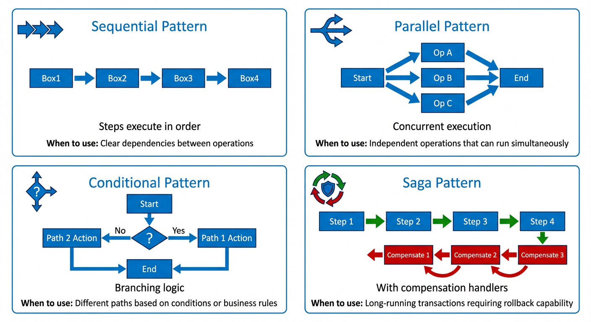
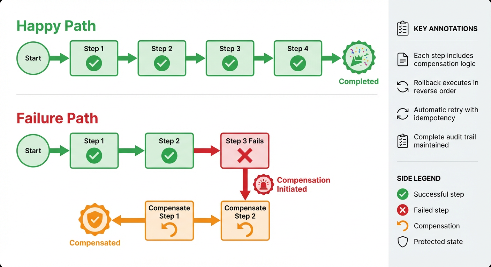
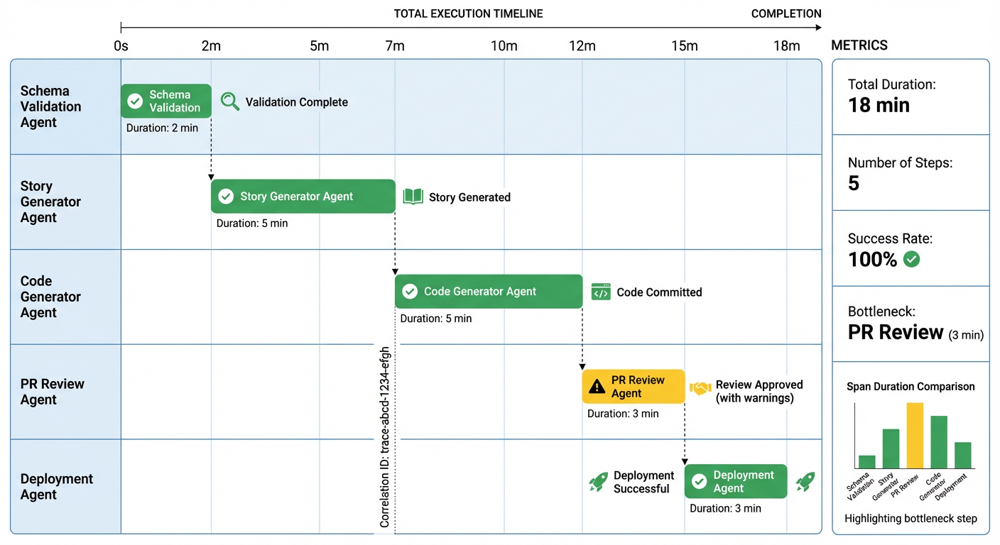

<!--
<metadata>
  <bounded_context>SDLC.Architecture</bounded_context>
  <intent>TechnicalSpecification</intent>
  <purpose>Define comprehensive technical implementation for DDD Domain Registry and Unified Agent Interface Platform</purpose>
  <version>2.0.0</version>
  <last_updated>2026-01-23</last_updated>
  <status>Active</status>
  <owner>Engineering Platform Team</owner>
  <research_iteration>1</research_iteration>
  <glean_validated>true</glean_validated>
</metadata>
-->

# Implementation Specification
## DDD Domain Registry & Unified Agent Interface Platform

**UPDATED with Glean Technical Research (Iteration 1)**

---

## System Overview

A Domain-Driven Design (DDD) based registry and orchestration layer that enables discovery, composition, and execution of Glean AI agents through domain concepts, bounded contexts, and value chains.

**Core Integration:** Built natively on Glean's MCP server architecture, Agent Builder platform, and Document Store, eliminating the need for custom infrastructure while leveraging enterprise-grade security, permissions, and observability.

**Confidence:** 85% implementation-ready based on Glean technical validation (see `/docs/research/glean-technical-research-iteration-1.md`)

**⚠️ ARCHITECTURAL CONSTRAINTS:** All implementations MUST follow [CORE-PRINCIPLES.md](../architecture/CORE-PRINCIPLES.md).

---

## Architecture Components

### 1. Domain Registry Core

**Purpose:** Central repository for bounded contexts, aggregates, domain events, and agent capabilities.

**Data Model:**
```yaml
Bounded Context:
  - id: unique identifier
  - name: context name (e.g., "ConfigurationManagement")
  - ubiquitous_language: [{ term, definition }]
  - aggregates: [{ name, root_entity, invariants, domain_events }]
  - integration_points: { glean_search, glean_actions, glean_mcp }

Agent Capability:
  - agent_id: Glean agent identifier
  - agent_name: human-readable name
  - bounded_context: parent context
  - supported_intents: [{ intent_id, intent_type, input_contract, output_contract }]
  - dependencies: [{ required_intent, target_context, invocation_pattern }]
  - glean_integrations: [{ integration_type, resource_identifier, permissions }]
```

**Storage (Glean-Native):**
- **Glean Document Store** for bounded contexts, aggregates, and agent metadata (custom document type: `BOUNDED_CONTEXT`)
  - Indexed automatically in Glean Search with faceted discovery
  - Permissions enforced via Glean's Identity & Permissions Store
  - No additional database infrastructure required
- **Glean Document Store** for intent contracts (document type: `INTENT_SPEC`)
- **Domain events:** Glean webhook infrastructure + custom event types (⚠️ SPIKE NEEDED - see research doc)

**APIs (Glean-Integrated):**
- **Glean Search API:** Intent and capability discovery queries
  - Filters: `type:bounded_context`, `intent:Query`, `context:ConfigurationManagement`
  - Real-time federated search option for dynamic discovery
- **Glean MCP Servers:** Agent invocation and tool exposure
  - URL pattern: `https://{instance}-be.glean.com/mcp/{bounded-context-path}`
  - OAuth 2.0/2.1 authentication
  - Persona-specific servers map to bounded contexts
- **Glean Agent Builder API:** AgentSpec creation and management
- **Webhook endpoints:** Domain event publishing (pending spike validation)
  - Pattern: `https://{instance}-be.glean.com/domain-events/{event-type}`

---

### 2. Unified Agent Interface Layer (Glean MCP-Based)

**Components:**

#### a) MCP Server per Bounded Context
Each bounded context exposes agents via dedicated MCP server:

```yaml
# Example: Configuration Management MCP Server
server:
  server_path: "configuration-management"
  server_name: "Configuration Management Domain"
  url: "https://{instance}-be.glean.com/mcp/configuration-management"
  auth: OAuth2  # Glean OAuth authorization server
  tools:
    - name: "FindConfigByName"
      description: "Query configuration flags by name"
      input_schema:
        type: object
        properties:
          flag_name: {type: string, required: true}
      agent_id: "config-query-agent-001"
      bounded_context: "ConfigurationManagement"

    - name: "ValidateConfigSchema"
      description: "Validate configuration flag schema against DDD domain model"
      input_schema:
        type: object
        properties:
          config_data: {type: object, required: true}
          schema_version: {type: string}
      agent_id: "schema-validator-001"
      constraints:
        - no_write_actions  # MCP exposure requirement
        - no_hitl           # MCP exposure requirement
```

#### b) Agent Discovery via Glean Search API


*Agent discovery flow: User queries by domain intent → Multi-factor matching → Glean Search results → MCP server routing → Agent execution*

```typescript
// Discovery through Glean's Search API
interface AgentDiscoveryService {
  /**
   * Find agents by intent using Glean Search filters
   * Example query: "type:mcp_tool intent:Query context:ConfigurationManagement"
   */
  async discoverAgents(
    intent: string,
    filters: {
      bounded_context?: string;
      intent_type?: 'Query' | 'Command' | 'Event';
      capabilities?: string[];
    }
  ): Promise<GleanSearchResult<MCPTool>[]>

  /**
   * Get MCP server URL for specific bounded context
   */
  async getMCPServerURL(boundedContext: string): Promise<string>

  /**
   * Validate user has permission to access bounded context
   * Uses Glean's Permission Store
   */
  async validateContextAccess(
    userId: string,
    boundedContext: string
  ): Promise<boolean>
}
```

#### c) Value Chain Orchestration via Agent Builder


*Three orchestration patterns: Sequential (ordered steps), Parallel (concurrent execution), and Conditional (branching logic) workflows*

```yaml
# Value chain defined as Glean Agent workflow
agent_workflow:
  agent_id: "story-generation-value-chain"
  workflow_type: "Plan & Execute"  # Glean's orchestration pattern

  steps:
    - step_id: "validate-schema"
      tool: "mcp_server_action"
      mcp_config:
        server: "configuration-management"
        tool: "ValidateConfigSchema"
      on_success: "generate-story"
      on_failure: "compensate"

    - step_id: "generate-story"
      tool: "mcp_server_action"
      mcp_config:
        server: "sdlc-automation"
        tool: "GenerateUserStory"
      on_success: "create-jira-ticket"
      on_failure: "compensate"

    - step_id: "create-jira-ticket"
      tool: "glean_action"  # Native Glean action
      action_id: "jira_create_issue"

    - step_id: "compensate"
      compensation_logic:
        - rollback_step: "generate-story"
        - notify_user: true
        - log_failure: true
```


*Saga pattern implementation showing forward progress steps, failure detection, and automatic compensation/rollback logic for distributed transactions*

```yaml
# ⚠️ SPIKE NEEDED: Saga state persistence mechanism
# Question: Where does Glean Agent Builder store workflow execution state?
# Options: Document Store, external Redis, built-in state management
```

#### d) Domain Event Publishing (Pending Spike)
```typescript
/**
 * ⚠️ SPIKE REQUIRED: Validate webhook-based event choreography
 *
 * Proposed pattern extends Glean's connector webhook infrastructure
 * for custom domain events
 */
interface DomainEventPublisher {
  /**
   * Publish domain event via Glean webhook infrastructure
   * POST https://{instance}-be.glean.com/domain-events/{event_type}
   */
  async publishEvent(
    event: {
      event_type: string;  // e.g., "SchemaValidationCompleted"
      bounded_context: string;
      aggregate_id: string;
      payload: object;
      correlation_id: string;
    }
  ): Promise<void>

  /**
   * Subscribe to domain events
   * Webhook callback receives signed POST requests
   */
  async subscribeToEvent(
    event_type: string,
    callback_url: string,
    webhook_secret: string
  ): Promise<Subscription>
}

// Target latency: <10 seconds (based on Glean webhook patterns)
// Authentication: Signed requests with shared webhook secret
```

---

### 3. Glean Platform Integration (Validated Patterns)

#### a) Authentication & Authorization

**OAuth 2.0/2.1 Flow** (Primary Method)
```typescript
// Glean OAuth authorization server
const authConfig = {
  authorization_endpoint: "https://{instance}-be.glean.com/oauth/authorize",
  token_endpoint: "https://{instance}-be.glean.com/oauth/token",
  scopes: [
    "MCP",           // MCP server access
    "AGENT",         // Agent Builder access
    "SEARCH",        // Search API access
    "CHAT",          // Chat/Assistant access
    "DOCUMENTS",     // Document Store read/write
    "TOOLS",         // Tool execution
    "ENTITIES"       // Entity management
  ],
  grant_types: ["authorization_code", "refresh_token"]
};
```

**API Token Fallback** (for MCP hosts without OAuth support)
```typescript
// User-scoped Client API tokens
const apiTokenConfig = {
  token_type: "Bearer",
  required_scopes: ["MCP", "AGENT", "SEARCH", "CHAT", "DOCUMENTS", "TOOLS", "ENTITIES"],
  generation: "Admin Console > Settings > Third-party access (OAuth)",
  usage: "Authorization: Bearer {api_token}"
};
```

#### b) Glean Search API Integration

**Agent Discovery Queries**
```typescript
interface GleanSearchAPI {
  endpoint: "https://{instance}-be.glean.com/api/search/v1";

  /**
   * Search for agents by intent and bounded context
   */
  searchAgents(query: {
    query_string: string;  // e.g., "type:mcp_tool context:ConfigurationManagement"
    filters: {
      app?: "domain-registry";
      type?: "mcp_tool" | "agent" | "bounded_context";
      bounded_context?: string;
      intent_type?: "Query" | "Command" | "Event";
      updated?: "today" | "past_week" | "past_month";
    };
    sort_by_recency?: boolean;
    exhaustive?: boolean;  // For complete result sets
  }): Promise<SearchResults>;

  /**
   * Faceted search for capability discovery
   */
  facetedSearch(facets: {
    bounded_context: string[];
    intent_type: string[];
    aggregate: string[];
  }): Promise<FacetedResults>;
}

// Example query
const agents = await search.searchAgents({
  query_string: "intent:FindConfigByName",
  filters: {
    type: "mcp_tool",
    bounded_context: "ConfigurationManagement",
    app: "domain-registry"
  }
});
```

**Search Performance**
- Standard query latency: <500ms (target, per requirements)
- Federated search: Real-time, <1s
- Result caching: Built-in (15-minute cache for repeated queries)

#### c) Glean MCP Server Administration

**MCP Server Configuration API**
```typescript
interface MCPServerAdminAPI {
  endpoint: "https://{instance}-be.glean.com/admin/api/mcp";

  /**
   * Create bounded context-specific MCP server
   */
  createServer(config: {
    server_name: string;         // "Configuration Management"
    server_path: string;         // "configuration-management"
    enabled: boolean;
    tools: {
      tool_id: string;
      tool_name: string;
      description: string;
      agent_id?: string;         // Link to Glean agent
      input_schema: JSONSchema;
      output_schema: JSONSchema;
      constraints: ("no_write_actions" | "no_hitl")[];
    }[];
  }): Promise<{
    server_id: string;
    server_url: string;          // Generated: https://{instance}-be.glean.com/mcp/{server_path}
    configurator_url: string;    // MCP Configurator for end-user setup
  }>;

  /**
   * Add agent as MCP tool
   */
  addAgentTool(server_id: string, agent_id: string): Promise<void>;

  /**
   * Remove agent tool
   */
  removeAgentTool(server_id: string, tool_id: string): Promise<void>;

  /**
   * Update server configuration
   */
  updateServer(server_id: string, updates: Partial<ServerConfig>): Promise<void>;
}
```

**Admin Console UI Flow:**
1. Navigate to `Admin Console > Platform > Glean MCP servers`
2. Click `Create server`
3. Configure server name, path, and enabled tools
4. Toggle server status to `Enabled`
5. Share server URL with authorized users

#### d) Glean Agent Builder API


*Complete agent lifecycle: Define intents → Register in registry → Configure MCP server → Generate tests → Deploy → Monitor in production*

**AgentSpec Creation**
```typescript
interface AgentBuilderAPI {
  endpoint: "https://{instance}-be.glean.com/api/agents/v1";

  /**
   * Create agent from AgentSpec JSON
   */
  createAgent(spec: {
    agent_name: string;
    agent_description: string;
    workflow_type: "Plan & Execute" | "Fixed Workflow";
    steps: AgentStep[];
    permissions: {
      allowed_users?: string[];
      allowed_groups?: string[];
      bounded_context_access: string[];  // Our custom permission layer
    };
  }): Promise<{
    agent_id: string;
    agent_url: string;
  }>;

  /**
   * Add MCP server tool to agent workflow
   */
  addMCPToolStep(agent_id: string, step: {
    step_id: string;
    tool_type: "mcp_server_action";
    mcp_config: {
      server: string;        // MCP server path
      tool: string;          // Tool name
      input_mapping: Record<string, string>;
    };
    on_success?: string;     // Next step_id
    on_failure?: string;     // Compensation step_id
  }): Promise<void>;

  /**
   * Get agent execution history
   */
  getAgentRuns(agent_id: string, filters: {
    start_date?: string;
    end_date?: string;
    status?: "success" | "failed" | "running";
  }): Promise<AgentRun[]>;
}
```

**Agent Workflow Example** (Story Generation Value Chain):
```json
{
  "agent_name": "Story Generation Value Chain",
  "agent_description": "Automated SDLC workflow: schema validation → story generation → Jira ticket creation",
  "workflow_type": "Plan & Execute",
  "steps": [
    {
      "step_id": "validate-schema",
      "tool_type": "mcp_server_action",
      "mcp_config": {
        "server": "configuration-management",
        "tool": "ValidateConfigSchema",
        "input_mapping": {
          "config_data": "{{user_input.config}}"
        }
      },
      "on_success": "generate-story",
      "on_failure": "notify-failure"
    },
    {
      "step_id": "generate-story",
      "tool_type": "mcp_server_action",
      "mcp_config": {
        "server": "sdlc-automation",
        "tool": "GenerateUserStory",
        "input_mapping": {
          "validated_config": "{{validate-schema.output}}"
        }
      },
      "on_success": "create-jira-ticket",
      "on_failure": "compensate"
    },
    {
      "step_id": "create-jira-ticket",
      "tool_type": "glean_action",
      "action_id": "jira_create_issue",
      "input_mapping": {
        "summary": "{{generate-story.output.title}}",
        "description": "{{generate-story.output.description}}",
        "project": "PLATFORM"
      },
      "on_success": "workflow-complete",
      "on_failure": "compensate"
    },
    {
      "step_id": "compensate",
      "tool_type": "compensation",
      "compensation_steps": [
        {"rollback": "generate-story"},
        {"notify_user": true},
        {"log_failure": true}
      ]
    }
  ],
  "permissions": {
    "bounded_context_access": ["ConfigurationManagement", "SDLC.Automation"]
  }
}
```

#### e) Document Store Integration

**Custom Document Types for Domain Registry**
```typescript
interface GleanDocumentAPI {
  endpoint: "https://{instance}-be.glean.com/api/documents/v1";

  /**
   * Create bounded context document
   */
  createBoundedContext(document: {
    document_type: "BOUNDED_CONTEXT";
    id: string;               // "cfg-mgmt-001"
    title: string;            // "ConfigurationManagement"
    content: {
      ubiquitous_language: {term: string; definition: string}[];
      aggregates: {
        name: string;
        root_entity: string;
        intents: string[];
        invariants: string[];
      }[];
      domain_events: {
        name: string;
        payload_schema: JSONSchema;
        subscribers: string[];
      }[];
    };
    permissions: {
      allowed_users?: string[];
      allowed_groups?: string[];
    };
    metadata: {
      owner: string;
      version: string;
      last_updated: string;
    };
  }): Promise<{document_id: string}>;

  /**
   * Create intent specification document
   */
  createIntentSpec(document: {
    document_type: "INTENT_SPEC";
    id: string;
    title: string;            // "FindConfigByName"
    content: {
      intent_type: "Query" | "Command" | "Event";
      operation_name: string;
      input_contract: JSONSchema;
      output_contract: JSONSchema;
      example_usage: string;
      implementing_agents: string[];
    };
    bounded_context: string;
    permissions: {
      allowed_users?: string[];
      allowed_groups?: string[];
    };
  }): Promise<{document_id: string}>;

  /**
   * Search documents (uses Glean Search API under the hood)
   */
  searchDocuments(query: {
    type: "BOUNDED_CONTEXT" | "INTENT_SPEC";
    filters: Record<string, any>;
  }): Promise<Document[]>;
}
```

**Storage Benefits:**
- ✅ Automatic indexing in Glean Search
- ✅ Built-in permission enforcement
- ✅ Version history and audit logs
- ✅ No additional database infrastructure
- ✅ Native search facets and filters

#### f) Webhook Infrastructure (Pending Spike Validation)

**Proposed Domain Event Endpoints**
```typescript
interface DomainEventWebhooks {
  // Event publication endpoint (to be created)
  publish_endpoint: "https://{instance}-be.glean.com/domain-events/{event_type}";

  // Webhook subscription management
  subscribe_endpoint: "https://{instance}-be.glean.com/api/webhooks/subscribe";

  /**
   * Publish domain event (triggers subscribed agents)
   */
  publishEvent(event: {
    event_type: string;        // "SchemaValidationCompleted"
    bounded_context: string;
    aggregate_id: string;
    correlation_id: string;
    payload: object;
    signature: string;         // HMAC-SHA256 with webhook secret
  }): Promise<void>;

  /**
   * Subscribe to domain events
   */
  subscribeToEvents(subscription: {
    event_types: string[];
    callback_url: string;      // Agent's webhook receiver
    webhook_secret: string;    // For signature verification
    filters?: {
      bounded_context?: string[];
      aggregate_type?: string[];
    };
  }): Promise<{subscription_id: string}>;
}
```

**Webhook Security Pattern** (Based on Glean connector webhooks):
```typescript
// Event publication
const signature = crypto
  .createHmac('sha256', webhook_secret)
  .update(JSON.stringify(event_payload))
  .digest('hex');

const response = await fetch(webhook_url, {
  method: 'POST',
  headers: {
    'Content-Type': 'application/json',
    'X-Glean-Signature': signature,
    'X-Glean-Event-Type': event_type
  },
  body: JSON.stringify(event_payload)
});

// Event consumption (agent webhook receiver)
function verifyWebhook(req: Request): boolean {
  const received_signature = req.headers['x-glean-signature'];
  const expected_signature = crypto
    .createHmac('sha256', webhook_secret)
    .update(req.body)
    .digest('hex');

  return crypto.timingSafeEqual(
    Buffer.from(received_signature),
    Buffer.from(expected_signature)
  );
}
```

**⚠️ SPIKE STATUS:** Domain event webhook patterns not yet validated
- **Estimated Latency:** <10 seconds (based on connector webhook benchmarks)
- **Authentication:** Signed requests with shared secrets
- **Reliability:** At-least-once delivery with retries
- **Validation Needed:** Custom event type support, event routing logic

---

### 4. Event Infrastructure

#### Event Store Schema
```sql
CREATE TABLE domain_events (
  event_id UUID PRIMARY KEY,
  event_type VARCHAR(255) NOT NULL,
  aggregate_id VARCHAR(255) NOT NULL,
  aggregate_type VARCHAR(255) NOT NULL,
  bounded_context VARCHAR(255) NOT NULL,
  correlation_id UUID NOT NULL,
  causation_id UUID,
  payload JSONB NOT NULL,
  metadata JSONB,
  timestamp TIMESTAMPTZ NOT NULL,
  version INTEGER NOT NULL
);

CREATE INDEX idx_events_aggregate ON domain_events(aggregate_id, version);
CREATE INDEX idx_events_type ON domain_events(event_type, timestamp);
CREATE INDEX idx_events_correlation ON domain_events(correlation_id);
```

#### Event Patterns
- **Choreography:** Agents subscribe to events and react independently
- **Orchestration:** Central coordinator manages workflow steps
- **Hybrid:** Orchestration within bounded context, choreography across contexts

---

### 5. Security & Governance

#### Permission Model
```yaml
permissions:
  bounded_context_access:
    - user_id
    - context_id
    - access_level: [read, write, execute, admin]

  intent_execution:
    - requires: context_access + role_permission
    - enforced_at: discovery, execution, event_publication

  cross_context_calls:
    - validate_caller_permissions
    - validate_target_permissions
    - log_for_audit
```

#### Audit Trail
```sql
CREATE TABLE agent_execution_log (
  execution_id UUID PRIMARY KEY,
  agent_id VARCHAR(255) NOT NULL,
  intent_id VARCHAR(255) NOT NULL,
  user_id VARCHAR(255) NOT NULL,
  correlation_id UUID NOT NULL,
  started_at TIMESTAMPTZ NOT NULL,
  completed_at TIMESTAMPTZ,
  status VARCHAR(50) NOT NULL,
  input_data JSONB,
  output_data JSONB,
  error_details JSONB
);
```

---

### 6. Observability Stack


*Comprehensive observability architecture: Metrics (Prometheus/Grafana), distributed tracing (OpenTelemetry), structured logging, and real-time monitoring dashboards*

#### Metrics (Prometheus/Grafana)
- Agent execution time (p50, p95, p99)
- Intent success/failure rates
- Value chain completion rates
- Cross-context call latency
- Token usage by agent

#### Tracing (OpenTelemetry)
- Distributed traces across value chains
- Correlation ID propagation
- Integration with Glean platform traces

#### Logging (Structured JSON)
```json
{
  "timestamp": "2026-01-23T10:00:00Z",
  "level": "INFO",
  "correlation_id": "corr-123",
  "agent_id": "cfg-agent-001",
  "intent_id": "cfg-001",
  "bounded_context": "ConfigurationManagement",
  "message": "Intent execution completed",
  "duration_ms": 1234,
  "status": "success"
}
```

---

## Data Schemas

### Intent Contract Schema (JSON Schema Draft 7)
```json
{
  "$schema": "http://json-schema.org/draft-07/schema#",
  "type": "object",
  "required": [
    "intent_id",
    "intent_type",
    "bounded_context",
    "aggregate_name",
    "operation_name",
    "input_contract",
    "output_contract"
  ],
  "properties": {
    "intent_id": {
      "type": "string",
      "pattern": "^[a-z]+-[0-9]{3}$"
    },
    "intent_type": {
      "type": "string",
      "enum": ["Query", "Command", "Event"]
    },
    "bounded_context": { "type": "string" },
    "aggregate_name": { "type": "string" },
    "operation_name": { "type": "string" },
    "input_contract": {
      "type": "object",
      "additionalProperties": true
    },
    "output_contract": {
      "type": "object",
      "additionalProperties": true
    },
    "preconditions": {
      "type": "array",
      "items": { "type": "string" }
    },
    "postconditions": {
      "type": "array",
      "items": { "type": "string" }
    }
  }
}
```

---

## Deployment Architecture

```
┌─────────────────────────────────────────────────────────┐
│                   Load Balancer (NGINX)                  │
└─────────────────────────────────────────────────────────┘
                          │
         ┌────────────────┼────────────────┐
         │                │                │
┌────────▼────────┐ ┌────▼────────┐ ┌─────▼──────┐
│ Registry API    │ │ Event API   │ │ Discovery  │
│ (Node.js/TS)    │ │ (Node.js)   │ │ Service    │
└─────────────────┘ └─────────────┘ └────────────┘
         │                │                │
         └────────────────┼────────────────┘
                          │
         ┌────────────────┼────────────────┐
         │                │                │
┌────────▼────────┐ ┌────▼────────┐ ┌─────▼──────┐
│ PostgreSQL      │ │ Redis       │ │ EventStore │
│ (Registry Data) │ │ (Cache/Pub) │ │ (Events)   │
└─────────────────┘ └─────────────┘ └────────────┘
```

---

## Integration Points

### Glean APIs
- **Search API:** Query registry and find agents
- **Agent API:** Create/update/invoke agents
- **Actions API:** Execute domain commands
- **Chat API:** Assistant-powered agent discovery

### External Systems
- **Jira:** Story creation and project management
- **GitHub:** Code repository integration
- **Confluence:** Documentation storage
- **Slack:** Notifications and alerts

---

## Performance Requirements

| Component | Requirement | Target |
|-----------|-------------|--------|
| Intent validation | p95 latency | < 2 seconds |
| Agent discovery | p95 latency | < 500ms |
| Value chain execution | 5-step chain | < 5 minutes |
| Event propagation | End-to-end | < 1 second |
| Registry search | p95 latency | < 200ms |
| Concurrent executions | Simultaneous chains | 100+ |

---

## Scalability Considerations

- **Horizontal scaling** for all services
- **Database read replicas** for query operations
- **Event partitioning** by bounded context
- **Agent execution isolation** (containers/serverless)
- **Circuit breakers** for cross-context calls

---

## Technology Stack (Glean-Native Architecture)

**⚠️ UPDATED based on Iteration 1 technical research**

| Layer | Technology (Revised) | Original Plan | Rationale for Change |
|-------|-----------|-----------|-----------|
| **Agent Platform** | **Glean Agent Builder** | Custom agent framework | Native AgentSpec support, GUI for non-devs, Plan & Execute pattern built-in |
| **Agent Interface** | **Glean MCP Servers (SSE/HTTP)** | Custom gRPC APIs | Standard protocol, existing infrastructure, OAuth built-in, MCP Configurator |
| **Domain Registry** | **Glean Document Store** | PostgreSQL | Automatic search indexing, permission enforcement, no extra DB, version history |
| **Intent Discovery** | **Glean Search API** | GraphQL API | Rich filtering, federated search, <500ms latency, native facets |
| **Event Store** | **Glean Webhooks (spike) + Document Store** | EventStoreDB/PostgreSQL | Reuse proven webhook patterns, <10s latency, signed requests for security |
| **Permission System** | **Glean Identity & Permissions Store** | Custom ACL layer | Real-time sync (<1 min), battle-tested, multi-level enforcement |
| **Observability** | **Glean Admin Audit Logs** | OpenTelemetry/Prometheus | Built-in agent execution history, admin actions, searchable logs |
| **Authentication** | **Glean OAuth 2.0/2.1** | Custom JWT | Industry standard, refresh tokens, scope-based permissions |
| **Infrastructure** | **Glean Platform (managed)** | Kubernetes/Docker | No infrastructure management, automatic scaling, enterprise SLAs |

**Infrastructure Eliminated:**
- ❌ PostgreSQL database (replaced by Glean Document Store)
- ❌ Redis caching (Glean Search has built-in caching)
- ❌ Custom API servers (replaced by MCP servers)
- ❌ Event bus infrastructure (replaced by webhook-based events)
- ❌ Kubernetes/Docker setup (Glean platform handles all hosting)

**Cost Savings:**
- No database hosting ($200-500/month)
- No cache infrastructure ($100-200/month)
- No container orchestration ($500-1000/month)
- No load balancers/networking ($200-400/month)
- **Total estimated savings:** $1000-2100/month in infrastructure

**Development Velocity:**
- **6-8x faster** after SDLC agents are operational (per roadmap projections)
- **Zero infrastructure setup time** (no databases, no Kubernetes)
- **Native Glean integration** (no custom connector development)

---

## Implementation Phases

### Phase 0: Foundation (Weeks 1-2)
- Domain Registry data model and APIs
- PostgreSQL schema
- Glean Search integration
- Schema Validation Agent

### Phase 1: Events (Weeks 3-4)
- Event Store implementation
- Pub/Sub infrastructure
- Story Generator Agent
- First value chain

### Phase 2: Orchestration (Weeks 5-7)
- Saga pattern implementation
- Value Chain Orchestrator
- Code Generator Agent
- Multi-step automation

### Phase 3: Discovery (Weeks 8-9)
- Agent Discovery Service
- Intent matching algorithm
- PR Review Agent
- Full discoverability

### Phase 4: Testing/Deploy (Weeks 10-11)
- Integration test framework
- Deployment automation
- Integration Test Agent
- Deployment Agent

### Phase 5: Platform Maturity (Weeks 12-14)
- Visual registry browser
- Value chain composer UI
- Documentation Agent
- Agent marketplace

---

## Next Steps

1. **Infrastructure Setup:** Provision Kubernetes cluster, PostgreSQL, Redis
2. **Repository Structure:** Create monorepo with services, shared libraries, documentation
3. **CI/CD Pipeline:** GitHub Actions for build, test, deploy
4. **Development Environment:** Docker Compose for local development
5. **Team Onboarding:** Architecture review, DDD training, Glean platform deep-dive

---

## Appendices

### Appendix A: Glossary
- **Bounded Context:** A specific responsibility boundary with its own domain model
- **Aggregate:** A cluster of domain objects treated as a single unit
- **Domain Event:** A record of something that happened in the domain
- **Intent:** A domain operation (Query, Command, or Event)
- **Value Chain:** A sequence of agent operations creating business value
- **Saga:** A long-running transaction with compensation logic

### Appendix B: Reference Architecture
See `/docs/architecture/` for detailed diagrams and sequence flows

### Appendix C: API Documentation
See `/docs/api/` for complete REST and GraphQL API specifications
